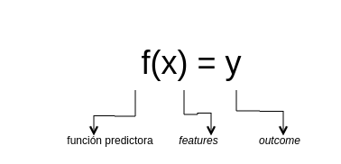
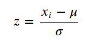
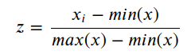
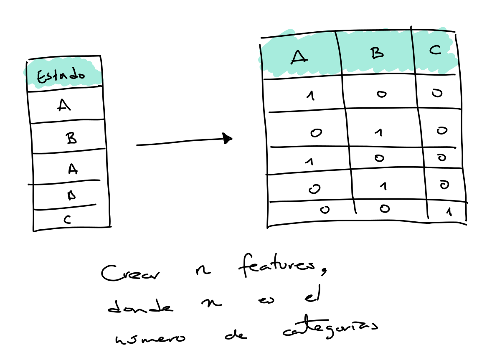
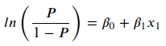
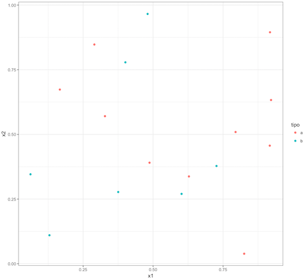
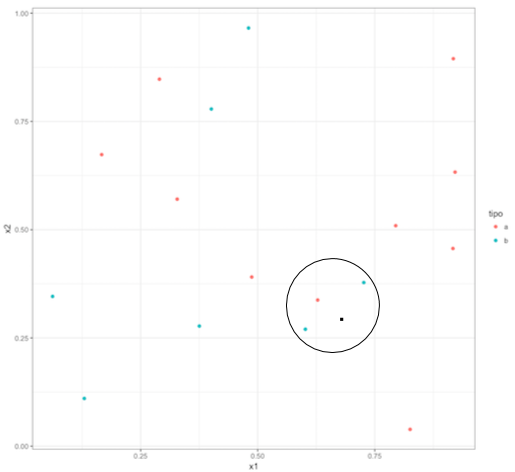
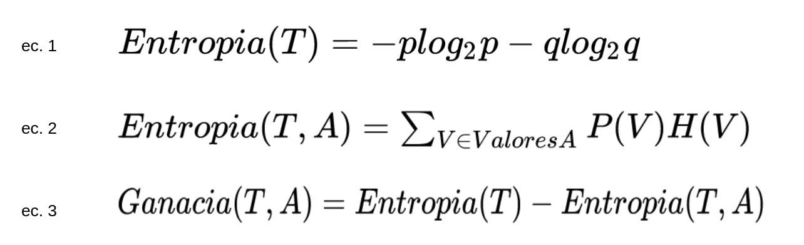
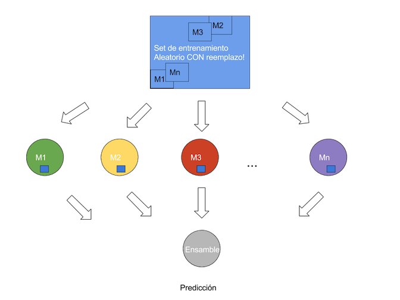
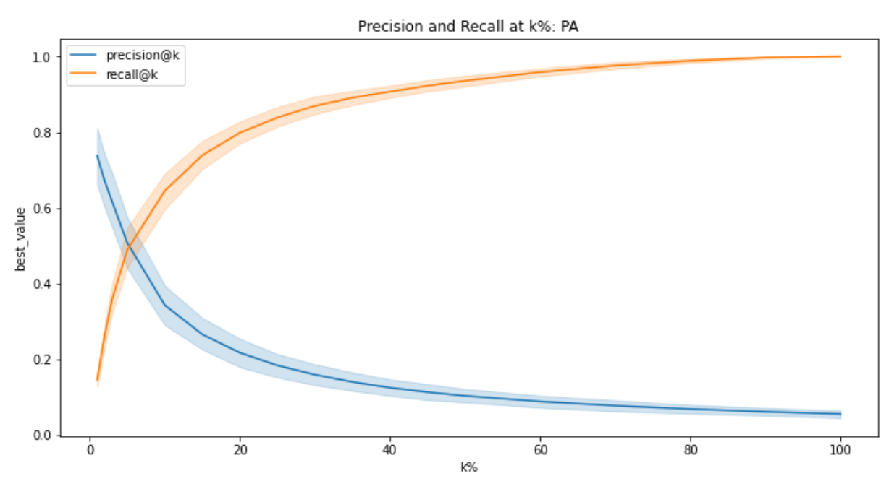

```{r setup, include=FALSE}
knitr::opts_chunk$set(echo = FALSE)
knitr::opts_chunk$set(message = FALSE, warning = FALSE)
```

# El proceso de sklearn

## De la teoría al código

\centering

{width=62%}

\raggedright

- Ya vimos la teoría: features, etiqueta, entrenamiento, sobreajuste, métricas
- Hoy la escribimos: `scikit-learn` (`sklearn`) es una librería de Python con casi todos los modelos que necesitamos
- Lo importante no es la sintaxis — es el **orden en que se hacen las cosas**

## El proceso de 4 pasos

El mismo para *casi cualquier* modelo de `sklearn`:

1. **Importar** la clase del modelo
2. **Instanciar** el modelo, eligiendo hiperparámetros
3. **Ajustar** (`fit`) con los datos de entrenamiento
4. **Predecir** (`predict` / `predict_proba`) sobre datos nuevos

- Aprender esto una vez sirve para regresión logística, KNN, árboles, bosques, Naive Bayes...
- Cambiar de modelo es cambiar **dos líneas**
- Que estos cuatro pasos corran **no** significa que el análisis esté bien

## Cómo trabajaremos: estas slides son el mapa

- **Estas slides son el resumen conceptual**; todo el código se ve, se corre y se rompe en vivo en los notebooks
- Esta clase se acompaña de **dos notebooks**, en este orden:
  - `notebooks/Logistic_Regression_NaiveBayes.ipynb` (iris, cáncer de mama)
  - `notebooks/KNN_DecisionTrees_RF.ipynb` (California housing, diabetes)
- El ritmo de la clase: una idea aquí → al notebook a hacerla → de regreso solo para el siguiente concepto
- Para estudiar: los notebooks son la referencia completa; estas slides son el repaso rápido de antes del examen

# El pipeline correcto

## El orden de las operaciones

\vspace{0.5em}

| Orden | Paso | Con qué datos |
|---|---|---|
| 1 | **Partir** en train y test | todos, una sola vez |
| 2 | **Aprender** las transformaciones (escalar, imputar, codificar) | **solo train** |
| 3 | **Aplicar** esas transformaciones | train **y** test |
| 4 | **Entrenar** el modelo | solo train |
| 5 | **Elegir** hiperparámetros y umbral | validación (nunca test) |
| 6 | **Evaluar** | solo test, una vez |

- Si un paso "aprende" algo de los datos, va **después** del split
- Ese es todo el contenido de la clase: el resto es sintaxis

## Primero el split, siempre

- El conjunto de prueba simula datos que **todavía no existen**: si el modelo ya vio algo de ellos, la evaluación es mentira
- `train_test_split` con `random_state` para que sea reproducible
- `stratify=y` conserva la proporción de la clase positiva en ambos conjuntos — importante cuando está desbalanceada
- Si los datos tienen tiempo (inspecciones, trámites, delitos), **no partas al azar**: entrena con el pasado y evalúa con el futuro
- Todo lo que "aprende" de los datos (escalar, imputar, codificar, seleccionar variables) va **después** del split

## Escalar: qué, por qué y sin fuga

\centering

{width=30%} \hspace{1em} {width=30%}

\raggedright

\vspace{0.3em}

- `StandardScaler`: media 0, desviación 1. `MinMaxScaler`: todo entre 0 y 1
- **Necesario** para modelos basados en distancia (KNN) y conveniente para regresión logística
- **Innecesario** para árboles y bosques: solo miran cortes, no magnitudes
- La media y la desviación se calculan **con train**; al test solo se le aplica `transform`

## Variables categóricas

\centering

{width=42%}

\raggedright

\vspace{0.3em}

- Codificar como 1, 2, 3... una variable sin orden le inventa una jerarquía al modelo
- El codificador también se ajusta **solo con train**, y hay que decidir qué hacer con las categorías que solo aparecen en test

# Los modelos

## Regresión logística: odds y logit

\centering

{width=55%}

\raggedright

\vspace{0.3em}

- La probabilidad vive entre 0 y 1; una regresión lineal no
- Los **odds** son $P/(1-P)$: probabilidad de que pase entre probabilidad de que no
- El **logit** es $\log(P/(1-P))$: eso sí va de $-\infty$ a $+\infty$, y eso es lo que modelamos linealmente
- Para volver a probabilidad usamos la inversa, la **sigmoide**: $\sigma(x) = 1/(1 + e^{-x})$

## Regresión logística: cuándo usarla y cómo leerla

- **Cuándo usarla**: clasificación binaria, cuando necesitas **explicar** el resultado y hay relaciones más o menos suaves
- Es la línea base obligatoria: si tu bosque aleatorio no le gana, quédate con la logística
- Cuando la clase positiva es rara, se le puede pedir que pese más los casos positivos
- **Cómo leer la salida**: el coeficiente es el cambio en el **log de los odds** por una unidad de la variable
  - `exp(coef)` es el **odds ratio**: 1.4 significa "los odds suben 40% por unidad"
  - Solo se pueden comparar coeficientes entre sí **si las variables están escaladas**
  - Un coeficiente **no** es un efecto causal: es asociación en estos datos
- Ojo: `predict` usa un corte fijo en 0.5 — casi nunca es el corte que quieres

## KNN: la idea y la distancia

\centering

{width=40%} \hspace{1em} {width=40%}

## KNN: cuándo usarlo y qué mirar

- Para clasificar un punto nuevo: busca sus $k$ vecinos más cercanos y hazles caso (mayoría o promedio)
- No hay "entrenamiento": el modelo *son* los datos
- Distancias: euclidiana $\sqrt{\sum (a_i - b_i)^2}$, Manhattan $\sum |a_i - b_i|$, Hamming (categóricas)
- **Sin escalar, la variable con números más grandes domina la distancia** y el resto no importa
- $k$ chica → frontera muy rugosa (sobreajuste); $k$ grande → todo se promedia (subajuste)
- Se elige probando varias $k$ y graficando el error — pero **eligiendo con validación, no con test**
- **Cuándo usarlo**: pocas dimensiones, frontera irregular, datos ya escalados. Lento al predecir

## Árboles: cómo eligen el corte

\centering

{width=50%}

\raggedright

\vspace{0.3em}

- Un árbol parte los datos con preguntas del tipo "¿`glucosa > 127`?"
- Elige el corte que deja los grupos resultantes **más puros**
- **Entropía**: mide desorden; la **ganancia de información** es cuánto desorden se elimina
- **Gini**: probabilidad de clasificar mal; 0 = puro, 0.5 = moneda al aire
- En la práctica dan árboles casi idénticos; `sklearn` usa Gini por default

## Árboles: cuándo usarlos y cómo leerlos

- **Cuándo usarlo**: cuando alguien tiene que poder leer la regla (un inspector, un juez, un comité)
- No hace falta escalar: el árbol solo mira cortes, no magnitudes
- Sin límite de profundidad ni de tamaño mínimo de hoja, el árbol **memoriza** los datos: precisión perfecta en train, inútil en test
- **Cómo leer la salida**: se puede imprimir el árbol como texto y seguir la regla nodo por nodo
- La *importancia de variables* dice cuánto ayudó cada variable a purificar los nodos — **no** es la dirección del efecto ni causalidad
- Un árbol es inestable: cambiar unas cuantas observaciones puede darte un árbol completamente distinto

## Bosque aleatorio

\centering

{width=45%}

\raggedright

\vspace{0.3em}

- Muchos árboles, cada uno con una muestra bootstrap y un subconjunto aleatorio de features; se vota

## Bosque aleatorio (cont.)

- La inestabilidad del árbol individual es justo lo que se aprovecha: promediar muchos árboles distintos baja la varianza
- Defaults de `sklearn`: 100 árboles, Gini, $\sqrt{M}$ features por corte
- Más árboles nunca empeora el modelo (solo lo hace más lento): el hiperparámetro que sí importa es la profundidad
- **Cuándo usarlo**: casi siempre que quieras el mejor desempeño con datos tabulares y no necesites una regla legible
- El costo: nadie puede leer 500 árboles. Ganas desempeño, pierdes explicación

## Naive Bayes

- Aplica el teorema de Bayes: $P(y \mid X) = P(X \mid y)\,P(y) / P(X)$
- "Naive" porque supone que todas las features son **independientes** entre sí dado $y$ — casi nunca es cierto
- Aun así funciona sorprendentemente bien, es rapidísimo y sirve con pocos datos
- **Cuándo usarlo**: texto (`MultinomialNB`), línea base instantánea
- **Cómo leer su salida**: sus probabilidades están mal calibradas — úsalas para **ordenar**, no como probabilidades reales

## ¿Cuál modelo uso?

\footnotesize

| Modelo | Escalar | Fuerte en | Débil en |
|---|---|---|---|
| Logística | conviene | explicar, línea base | relaciones no lineales |
| KNN | **obligatorio** | fronteras irregulares | muchas features, predicción lenta |
| Árbol | no | reglas legibles | inestable, sobreajusta |
| Bosque | no | desempeño tabular | caja negra |
| Naive Bayes | no | texto, velocidad | supuesto de independencia |

\normalsize

- Empieza por la logística. Compara siempre contra una **línea base tonta** (predecir siempre la clase mayoritaria)

# Leer los resultados

## Matriz de confusión

\vspace{0.5em}

\footnotesize

|  | Predijo 0 | Predijo 1 |
|---|---|---|
| **Real 0** | VN | **FP** — molestamos a quien no debíamos |
| **Real 1** | **FN** — se nos escapó | VP |

\normalsize

\vspace{0.5em}

- Antes de mirar cualquier número: ¿qué cuesta más en *este* problema, un FP o un FN?
- El accuracy no distingue entre los dos, y con clases desbalanceadas es una trampa
- Con 5% de casos positivos, "predecir siempre 0" da 95% de accuracy y cero utilidad

## Precisión, cobertura y el umbral

- **Precisión** = $TP/(TP+FP)$: de los que señalé, ¿cuántos eran?
- **Cobertura (recall)** = $TP/(TP+FN)$: de los que había, ¿a cuántos encontré?
- Un modelo que dice "todos tienen cáncer" tiene cobertura 100% y precisión inútil
- Las dos dependen del **umbral**, no del modelo: mover el corte de 0.5 a 0.3 sube cobertura y baja precisión
- La curva precisión–cobertura muestra ese intercambio para todos los umbrales a la vez
- Elegir el umbral es una decisión de política, no estadística

## ROC y AUC

- La curva ROC grafica TPR contra FPR **para todos los umbrales posibles**
- El **AUC** resume la curva: 0.5 = azar, 1.0 = perfecto. Mide qué tan bien **ordena** el modelo
- Es invariante a la escala y al umbral — eso suena bien, pero significa que **ignora el costo asimétrico**
- Con clases muy desbalanceadas, la curva precisión–cobertura dice más que el AUC
- Un AUC alto y un modelo inservible conviven sin problema: el AUC no sabe cuántos casos puedes atender

## Métricas @k: cuando hay presupuesto

\centering

{width=38%}

\raggedright

- Tienes 20 inspectores, no 2,000: no importa la clasificación completa, importan **los 20 casos que mando**
- Se ordena por probabilidad, se toma el top $k$, y se calcula precisión y cobertura **ahí**
- Precisión@20 = qué proporción de los 20 que mandé eran de verdad. Cobertura@20 = de todos los que había, qué proporción alcancé
- Esta es casi siempre la métrica honesta en política pública, porque el presupuesto es el que fija $k$

# Mapa y trampas

## El mapa: de cada paso a su herramienta

\vspace{0.3em}

\footnotesize

| Paso | En `sklearn` | Trampa |
|---|---|---|
| Partir | `train_test_split` | sin `stratify` ni `random_state` |
| Escalar | `StandardScaler` | `fit` en test |
| Codificar | `OneHotEncoder` | categoría nueva en test |
| Entrenar | `.fit(X_train, y_train)` | usar todos los datos |
| Predecir | `.predict` / `.predict_proba` | quedarse con la clase, no la probabilidad |
| Evaluar | `confusion_matrix`, `roc_auc_score` | reportar solo accuracy |
| Elegir $k$, umbral | validación | elegirlos mirando test |

\normalsize

## Tres trampas (las veremos en vivo en los notebooks)

1. **La fuga de datos es silenciosa:** escalar, imputar o seleccionar variables *antes* del split no truena, no avisa, y sube todas las métricas. El síntoma siempre es el mismo: **resultados demasiado buenos**
2. **`predict` decide por ti:** usa un corte fijo en 0.5 que nadie eligió. Casi siempre quieres `predict_proba` y fijar tú el umbral según lo que cueste un FP y un FN
3. **El accuracy miente con clases desbalanceadas:** si la clase positiva es el 5%, la línea base tonta ya tiene 95%. Sin comparar contra ella, ningún número significa nada

- Regla transversal: escalar es **obligatorio** para KNN e **irrelevante** para árboles — y en ambos casos el código corre igual

# Al notebook

## Lo que vamos a hacer en `Logistic_Regression_NaiveBayes.ipynb`

1. **Qué es `sklearn`** y el proceso de 4 pasos, con los datos de iris
2. **De dónde viene la regresión logística**: odds, logit y la función sigmoide, construidas a mano
3. **Implementación** con `sklearn`: importar, instanciar, ajustar, predecir
4. **Evaluación**: matriz de confusión y accuracy, y por qué el accuracy no basta
5. **Un caso real**: datos de cáncer de mama (`../data/cancer.csv`) — limpiar, partir, entrenar, leer coeficientes
6. **Naive Bayes**: cómo funciona el algoritmo y por qué es la línea base más barata que existe

- Los **ejercicios están marcados en el notebook** — se hacen ahí, en el momento

## Lo que vamos a hacer en `KNN_DecisionTrees_RF.ipynb`

1. **KNN y las distancias**: euclidiana, Manhattan, Hamming — y el escalamiento con `MinMaxScaler`
2. **El escalador paso a paso**: qué hace exactamente, y por qué al test solo se le aplica `transform`
3. **Predecir con los $k$ vecinos** y elegir $k$ sin tocar el conjunto de prueba
4. **Árboles de decisión**: el algoritmo, entropía y Gini, y cómo leer la regla que produce
5. **Métricas de desempeño**: matriz de confusión, ROC, AUC, precisión y cobertura, y **métricas @k**
6. **Random Forest** sobre los mismos datos de diabetes, para comparar contra el árbol solo

- Los **ejercicios están marcados en el notebook** — se hacen ahí, en el momento

# El agente y el orden de las operaciones

## La fuente #1 de errores

- Los agentes escriben la sintaxis de `sklearn` perfecta. Lo que se equivocan es **el orden**
- Los tres errores que verás una y otra vez:

```python
# MAL: escala con todos los datos y DESPUÉS parte  -> fuga de datos
X_s = StandardScaler().fit_transform(X)
X_train, X_test, y_train, y_test = train_test_split(X_s, y)

# MAL: vuelve a ajustar el scaler en test
X_test_s = StandardScaler().fit_transform(X_test)

# MAL: elige k / max_depth probando en el test set
```

- El síntoma siempre es el mismo: **resultados demasiado buenos**
- Si el accuracy es 0.99, la hipótesis #1 es fuga, no genialidad

## Qué verificar cuando el agente hace esto

1. **¿El `train_test_split` está antes que todo lo demás?** Busca cualquier `fit` o `fit_transform` que ocurra antes del split
2. **¿Hay algún `fit_transform` aplicado a `X_test`?** En test solo va `transform`
3. **¿Escaló donde hacía falta?** KNN sin escalar es un error silencioso; el código corre igual
4. **¿La métrica es la del problema?** Si reporta accuracy con una clase al 5%, pide matriz de confusión, precisión y cobertura — y pregunta qué cuesta más, FP o FN
5. **¿Los hiperparámetros se eligieron sin tocar test?** `k`, `max_depth`, umbral: todo se elige con validación
6. **¿Comparó contra una línea base?** Sin la clase mayoritaria como referencia, ningún número significa nada
