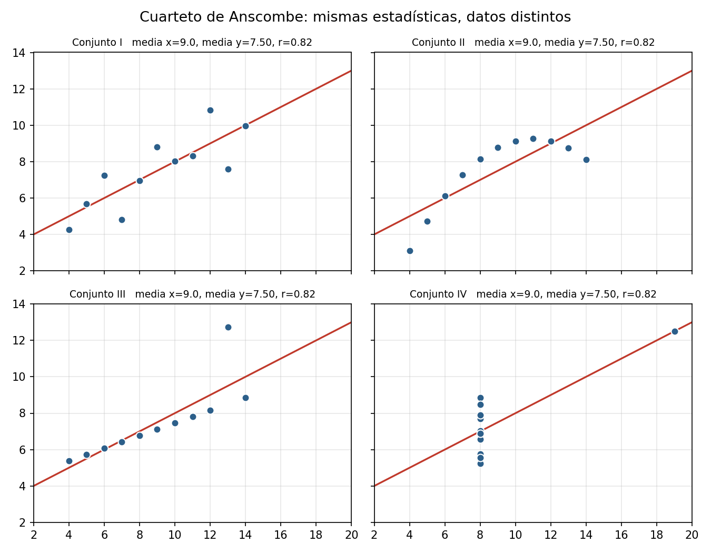
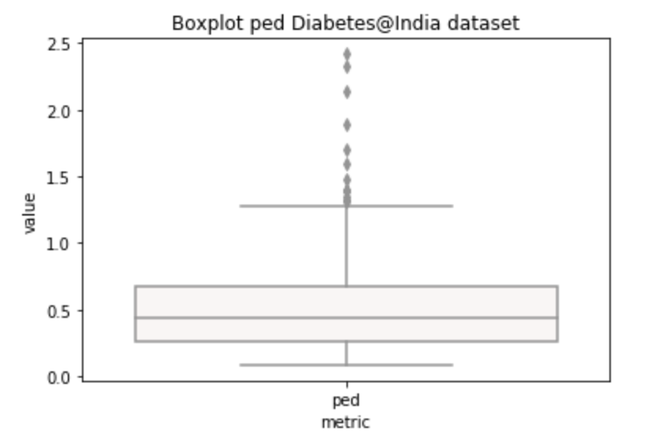

```{r setup, include=FALSE}
knitr::opts_chunk$set(echo = FALSE)
knitr::opts_chunk$set(message = FALSE, warning = FALSE)
```

# ¿Qué es el análisis exploratorio?

## Mirar los datos antes de modelar

> "Loosely speaking, any method of looking at data that does not include formal statistical modeling and inference falls under the term exploratory data analysis" — Howard Seltman

- Origen: Mosteller y Tukey (1977), *Data analysis and regression*
- La idea: **mira los datos para ver lo que parecen decir**, antes de imponerles un modelo
- Objetivos concretos:
  - entender la estructura del conjunto de datos y las variables importantes
  - detectar valores atípicos, anomalías y datos faltantes
  - comprobar los supuestos que un modelo va a dar por buenos

## Dos enfoques

\vspace{0.9em}
\footnotesize

| Enfoque clásico | EDA |
|--------------------------------|--------------------------------|
| Problema → Datos → **Modelo** → Análisis → Conclusiones | Problema → Datos → **Análisis** → Modelo → Conclusiones |
| Impone el modelo | Los datos sugieren el modelo |
| Técnicas cuantitativas: pruebas de hipótesis, ANOVA, mínimos cuadrados | Técnicas gráficas: histogramas, scatter plots, boxplots, residual plots |
| Hace supuestos | Sin supuestos previos |
| Riguroso | Subjetivo e interpretativo |

\normalsize

- No son rivales: EDA es lo que haces **antes** para que el modelo clásico tenga sentido

## El cuarteto de Anscombe

::::: columns
::: {.column width="45%"}
{width=100%}
:::

::: {.column width="53%"}

\raggedright
- Cuatro conjuntos con **la misma media, la misma varianza, la misma recta de regresión y la misma correlación (r = 0.82)**
- Y cuatro historias distintas: lineal, curva, un outlier que arrastra la recta, y una x casi constante
- Moraleja: **es fácil falsear una estadística de resumen; es mucho más difícil falsear una distribución**
:::
:::::

## El mapa del EDA

\vspace{0.4em}
\footnotesize

| Pregunta | Cómo se contesta | Qué está buscando |
|---|---|---|
| ¿Qué tengo? | `shape`, `info`, `dtypes` | ¿coincide con lo que dice la fuente? |
| ¿Cuál es la unidad? | ¿la llave es única? | qué es un renglón |
| ¿Cómo se ve una variable? | histograma + `describe` | forma, sesgo, topes de codificación |
| ¿Y una categórica? | `value_counts` | categorías repetidas, mal escritas, vacías |
| ¿Qué falta? | `isnull().mean()` por columna | patrón, no solo cantidad |
| ¿Hay imposibles? | `min`, `max`, centinelas | `-99`, negativos, fechas del futuro |
| ¿Se mueven juntas? | scatter, correlación | relaciones (y sus trampas) |

\normalsize

- El orden importa: **primero mirar, después resumir**. Un `describe()` sin gráfica es Anscombe esperando a pasar

# La distribución de una variable

## Una variable sola: conteos e histogramas

**Categóricas** — el conteo por categoría es el punto de partida

- ¿El orden es el esperado? Las **ordinales hay que declararlas** como tales, o `pandas` las ordena alfabéticamente
- Con muchísimas categorías la gráfica deja de comunicar: agrupa la cola larga en `otros`
- **Ojo con promediar categorías**: si codificas [1, 2, 3] y sacas promedio, puedes obtener 2 aunque nadie haya escogido 2

**Continuas** — el histograma parte el rango en intervalos iguales y cuenta

- Lo que buscamos es **señal**: un pico, una tendencia central
- Una distribución uniforme (todas las cajas igual de altas) es señal de que *no hay señal*
- Error común: creer que los datos continuos "deberían" seguir una normal. En la naturaleza casi ninguna variable lo hace

## El parámetro cambia la historia

\begin{center}
\includegraphics[width=0.28\textwidth]{../images/histogram_bins_1.png}\hspace{0.5em}
\includegraphics[width=0.28\textwidth]{../images/histogram_bins_2.png}
\end{center}

- Los **mismos datos** con `bins` por defecto y con `bins=50`: con 50 cajas aparece la estructura fina; con pocas se suaviza y se pierde
- La barra en 50 no es ruido: es un **tope de codificación** (todo valor ≥ 50 se registró como 50), y solo se ve con suficientes cajas
- Igual con la **densidad** (`kde`): ancho de banda grande → curva suave; chico → ruido puro
- Regla: prueba **dos anchos** antes de concluir algo sobre la forma, y reporta histograma y densidad juntos

## Sesgo y transformaciones

- Sesgo a la derecha: cola larga a la derecha (ingreso, empleo, población, precios). A la izquierda: cola larga a la izquierda (edad de jubilación, calificaciones con techo)
- Una variable muy sesgada comprime la masa central en un pedacito de la gráfica: **no se puede inspeccionar visualmente**
- Antes de "arreglarla", **investiga la cola**: la cola de `all.emp` son Cook (Chicago), Los Ángeles y los cinco condados de Nueva York — el 20% de condados más poblados concentra el 85.9% del empleo
- Si la cola tiene explicación sustantiva, no es un problema: **es el fenómeno**
- Muchos modelos suponen normalidad. Sesgo a la derecha → **logaritmo** o **raíz**; a la izquierda → cuadrado
- El **gráfico QQ** dice si sirvió: tus cuantiles contra los de una normal teórica — entre más pegados a la recta, mejor
- No transformes a ciegas: ganas supuestos y **pierdes interpretabilidad**

# Centralidad, dispersión y valores extremos

## Media vs. mediana

- **Media**: sensible a la cola. En una variable sesgada, la media se va detrás de los valores extremos
- **Mediana**: el valor de en medio; no le importa qué tan lejos esté la cola
- **Moda**: la única que tiene sentido para datos ordinales o categóricos
- Si comparas conteo, suma, media y mediana por región vas a ver **cuatro rankings distintos** de las mismas regiones
- Regla práctica: si media y mediana difieren mucho, la variable es sesgada y **la mediana es el resumen honesto**
- En política pública esto importa: "el ingreso promedio del municipio" y "el ingreso del habitante típico" no son lo mismo

## Dispersión: qué tan lejos están del centro

\vspace{0.3em}
\footnotesize

| Medida | Interpretación | Cuidado |
|--------------|-----------------------------|-----------------------|
| Varianza | Grado de dispersión; alto = datos lejos del promedio | Está en unidades al cuadrado |
| Desviación estándar | Raíz de la varianza; en **las mismas unidades** que el promedio | Igual de sensible a outliers que la media |
| Rango intercuartil (IQR) | Ancho del 50% central | Robusto: es el que usa el boxplot |
| Coeficiente de variación | sd / media, en % — permite comparar variables con **unidades distintas** | Un CV > 100% dice que el promedio casi no informa |

\normalsize

- Para pensar: dos poblaciones con la misma estatura promedio pero varianzas muy distintas, ¿son la misma población?
- Si un intervalo de confianza contiene valores positivos y negativos, **no puedes concluir que el efecto es positivo**

## Valores extremos: cómo se ven y qué hacer

::::: columns
::: {.column width="38%"}
{width=100%}
:::

::: {.column width="60%"}

\raggedright
- El boxplot marca como atípico lo que cae fuera de los bigotes (1.5 × IQR)
- En un histograma se ven poniendo un **límite al eje y**: son tan pocos que no se distinguen del cero
- Diamantes con ancho 0 mm o 58 mm no son outliers estadísticos: son **errores de captura**
:::
:::::

Tres opciones, ninguna gratis: **tirarlos** (pierdes información y sesgas si el extremo es real), **convertirlos en faltantes** (conservas el renglón, marcas la duda), **winsorizar** (recortar al percentil 1 y 99).

- ¿Cómo decidir? **Pregúntale a quien construyó la base** por qué esos valores son raros
- En datos reales *toda* columna tiene basura: si tiras cada renglón con un valor raro, te quedas sin base

# Valores faltantes

## Un faltante no siempre se llama NaN

- Revisa **siempre el diccionario de datos**: no es lo mismo un dato faltante, un "No aplica" y un cero
- Los códigos centinela (`-99`, `999`, `-1`, `""`, `"N/A"`) entran como números y **contaminan promedios sin avisar**
- Los infinitos (`np.inf`) son otro caso: no son nulos, y `isnull()` no los ve
- `pandas` usa dos representaciones: `np.nan` (float, rápido, de NumPy) y `None` (objeto de Python, lento)
- Detectar es fácil (`isnull`, `notnull`, `dropna`, `fillna`); lo importante es el **patrón**:
  - por columna: ¿hay una variable que casi nadie contestó?
  - por renglón: ¿hay un grupo de observaciones que no contestó casi nada?

## El mecanismo importa: MCAR, MAR, MNAR

Rubin (1976). El tratamiento correcto depende de **por qué** falta el dato:

- **MCAR** (*completely at random*): la falta no se correlaciona con nada observado. La no respuesta a "ingreso" es independiente de escolaridad o pobreza. **No sesga**
- **MAR** (*at random*): la falta depende de variables **observadas**. No responden ingreso los de menor escolaridad — y la escolaridad sí la tienes. **Sesga si no lo tratas**
- **MNAR** (*not at random*): la falta depende del valor **no observado**. No responden ingreso justamente los de ingreso alto. **El caso feo**: no se puede diagnosticar con los datos, requiere conocimiento del tema

- Se diagnostica comparando a los que sí contestaron contra los que no, en las variables que sí tienes. Eso distingue MCAR de MAR — **nunca MNAR**

## Por qué "borrar los NaN" sesga

- `dropna()` es la primera línea que escribe cualquier agente. Dos problemas:

**1. Te quedas sin datos.** Con 100 columnas y ~12% de faltantes por columna, casi **ningún** renglón está completo. Hay un intercambio entre renglones completos y variables retenidas: a veces conviene tirar la columna, no el renglón

**2. Los que quedan no son como los que se fueron.** Si el mecanismo es MAR, el análisis de casos completos describe a **quienes sí respondieron**, no a la población

- Además, `groupby().mean()` descarta faltantes en silencio: "el promedio de todos" en realidad es "el promedio de los que tenían dato"
- Mínimo exigible: reportar cuántos renglones se perdieron y **comparar los que se van contra los que se quedan**

## Tratamiento de los faltantes

\vspace{0.2em}
\scriptsize

| Opción | Descripción | MCAR | MAR |
|-------------------|-------------------------------------|:------:|:-----:|
| *Listwise deletion* | Eliminar el renglón con cualquier faltante (casos completos) | x | |
| *Drop variable* | Eliminar la variable — si los faltantes se concentran en una columna | x | x |
| Media / mediana | Sustituir por el centro. Media si es simétrica, **mediana si es sesgada** | x | |
| Moda | Para variables discretas | x | |
| Basada en modelo | Predecir el faltante con kNN, árboles, *random forest* | x | x |
| Imputación múltiple | Imputar varias veces y promediar, para no subestimar la incertidumbre | x | x |

\normalsize

- Imputar la media **preserva la media y destroza la forma**: pico artificial en el centro, varianza subestimada
- **Verifícalo**: grafica la densidad original contra la imputada. Si la forma cambió, la imputación inventó estructura
- Regla de higiene que veremos en modelos: **imputa después del split, con estadísticas de train**

# Correlaciones y cierre

## La nube de puntos y el coeficiente de Pearson

\begin{center}$\rho_{X,Y} = \dfrac{cov(X,Y)}{\sigma_X \sigma_Y}$\end{center}

- Mide fuerza y dirección de una relación **lineal**, entre −1 y 1
- La nube de puntos va **antes** que el coeficiente: el número resume, la nube explica
- Con dos variables: scatter con recta ajustada, y las marginales al lado para no perder de vista cada distribución
- Con un grupo de variables: matriz de correlación o `clustermap` para agrupar las que se mueven juntas — pero **léela como mapa, no como conclusión**
- Con dos categóricas: una tabla cruzada de frecuencias, vista como mapa de calor
- Y siempre: ¿la relación se mantiene **dentro** de cada subgrupo, o solo entre grupos?

## Las trampas de la correlación

\vspace{0.5em}

\begin{center}
\includegraphics[width=0.30\textwidth]{../images/spurious_correlations.png}\hspace{0.8em}
\includegraphics[width=0.36\textwidth]{../images/xkcd_correlation.png}
\end{center}

\vspace{0.2em}

1. **Correlación ≠ causalidad**, y con suficientes variables siempre encuentras una correlación alta por azar
2. Pearson **solo ve líneas**: una U perfecta tiene correlación ≈ 0. Si la nube no es una "línea difusa", sigue investigando
3. Un solo outlier puede crear o destruir una correlación (Anscombe III y IV)
4. Fíjate hasta en el eje: en la gráfica de piratas el eje x **ni siquiera está ordenado**

## La regla del curso

\vspace{0.8em}

\begin{center}\textbf{Nunca modifiques la base original.}\end{center}

\vspace{0.8em}

- Puedes **agregar** columnas (`y_winsor`, `ba_imputada`, `es_outlier`), nunca borrar renglones, columnas o celdas del archivo fuente
- Todo filtro y toda imputación vive en el código, no en el archivo: así el análisis es reproducible y auditable
- Documenta cada decisión: cuántos renglones quitaste, con qué criterio y qué pasa si no los quitas
- Y la pregunta de cierre del EDA: **¿la conclusión sobrevive si tomo la otra decisión razonable?**

# Al notebook

## Lo que vamos a hacer en `EDA.ipynb`

1. **matplotlib y seaborn** en breve, sobre series económicas de EE.UU.
2. **Distribuciones discretas**: `countplot`, categorías ordinales, colas largas de categorías
3. **Distribuciones continuas**: histogramas, `bins`, densidad y ancho de banda; variables asimétricas, log, raíz y gráfico QQ
4. **Outliers**: boxplot, límites del eje, y las tres opciones (tirar, `NaN`, winsorizar)
5. **Faltantes**: detección, patrón por columna y renglón, diagnóstico MCAR/MAR, `dropna` vs. imputación (media, mediana, kNN) y qué le hace cada una a la distribución
6. **Series de tiempo** y **correlaciones**: `regplot`, `jointplot`, `lmplot` por grupo, `pairplot`, mapas de calor y datos de mayor dimensionalidad

- Los **ejercicios en clase** están marcados en el notebook — se hacen ahí, en el momento

## Qué verificar cuando el agente hace esto

1. **¿Graficó, o solo reportó estadísticas de resumen?** Un `describe()` sin histograma es Anscombe esperando a pasar. Pide la distribución de toda variable clave
2. **¿Usó media donde la variable es sesgada?** Compara media y mediana; si difieren mucho y el reporte dice "promedio", el número está inflado por la cola
3. **¿Cuántos renglones sobrevivieron?** Exige `len(df)` antes y después de cada `dropna()` o filtro, y la comparación entre quienes se fueron y quienes se quedaron
4. **¿Justificó el mecanismo de faltantes?** Un `dropna()` o un `fillna(mean)` sin diagnóstico MCAR/MAR es una decisión escondida, no una limpieza

## Qué verificar cuando el agente hace esto (cont.)

5. **¿Revisó códigos centinela y valores imposibles?** `-99`, ceros donde no puede haberlos, topes de codificación: `min()`, `max()` y `value_counts()` de los extremos
6. **¿Modificó la base original?** Cualquier archivo de datos que cambió de tamaño es una bandera roja: la limpieza va en el código
7. **¿La correlación que reporta es lineal y tiene sentido sustantivo?** Pídele el scatter, no el número
