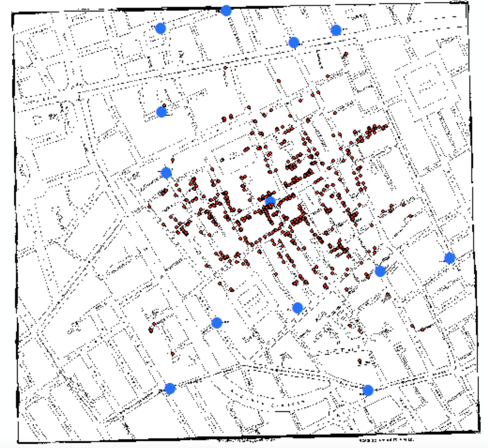
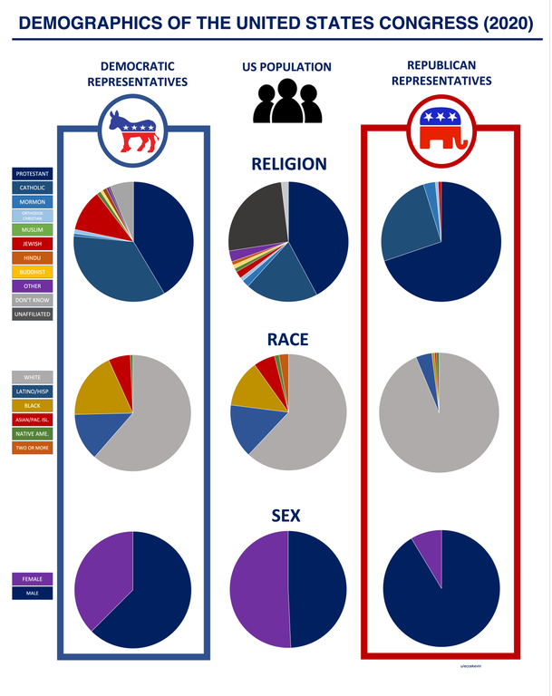

```{r setup, include=FALSE}
knitr::opts_chunk$set(echo = FALSE)
knitr::opts_chunk$set(message = FALSE, warning = FALSE)
```

# ¿Por qué visualizar?

## John Snow y el cólera, Londres 1854

::::: columns
::: {.column width="38%"}
{width=100%}
:::

::: {.column width="60%"}

\raggedright
- Un brote mató a más de 500 personas en pocos días
- Snow tenía la teoría de que el agua transmitía la enfermedad, pero **no podía demostrarlo con una tabla**
- Marcó en un mapa dónde moría la gente y dónde estaban las bombas de agua, y dibujó polígonos alrededor de cada bomba
- Las muertes se concentraban en una sola bomba: la de Broad Street
- La gráfica **encontró** el hallazgo; no lo ilustró
:::
:::::

## La composición del Congreso de EE.UU.

::::: columns
::: {.column width="28%"}
{width=100%}
:::

::: {.column width="70%"}

\raggedright
- Cada legislador es un punto; la posición codifica su ideología estimada
- Lo que se ve no es un dato nuevo: es un **proceso** — la desaparición del centro a lo largo de décadas
- Una tabla con el promedio ideológico por partido no muestra la polarización; muestra dos números
:::
:::::

## Quién habla en las películas de Disney

\begin{center}
\includegraphics[width=0.70\textwidth]{../images/Disney.png}
\end{center}

- Líneas de diálogo por género en cada película
- La pregunta parecía imposible de contestar sin ver todas las películas; la gráfica la contesta de un golpe
- Las tres historias tienen algo en común: **la gráfica es la herramienta de análisis, no el adorno del reporte**

## Para qué sirve una gráfica

- **Explorar**: encontrar patrones que no sabías que estaban ahí (Snow)
- **Entender**: darle forma a algo que ya medías (el Congreso)
- **Explicar**: comunicar un hallazgo a alguien que no vio los datos (Disney)
- **Preguntar**: casi siempre una buena gráfica genera la siguiente pregunta

\vspace{0.8em}

- En este curso: `matplotlib` para control fino y `seaborn` para gráficas estadísticas rápidas
- Regla práctica: usa la que sea **más sencilla** para lo que necesitas

## Cómo trabajaremos: estas slides son el mapa

- **Estas slides son el resumen conceptual**: para qué sirve una gráfica, cómo elegirla y cómo detectar cuándo miente
- **Todo el código se ve, se corre y se rompe en vivo en el notebook**: abran ahora `notebooks/Visualizacion.ipynb` (datos: `mpg` — consumo de gasolina de 234 modelos de auto)
- El ritmo de la clase: una idea aquí → al notebook a dibujarla → de regreso solo para el siguiente concepto
- Para estudiar: el notebook es la referencia completa de sintaxis; estas slides son el criterio para juzgar una gráfica

# Elegir la gráfica según la pregunta

## Cuatro preguntas, cuatro familias

\vspace{0.9em}
\footnotesize

| Si la pregunta es… | La gráfica es… |
|------------------------------------------|-----------------------|
| ¿Cómo se reparte esta variable? (**distribución**) | histograma, densidad, boxplot |
| ¿Cómo se mueven juntas estas dos? (**relación**) | dispersión, burbuja, mapa de calor |
| ¿Cuál grupo tiene más? (**comparación**) | barras (ordenadas), boxplot por grupo |
| ¿Cómo cambió esto en el tiempo? (**evolución**) | línea, área |
| ¿De qué está hecho el total? (**composición**) | barras apiladas, cascada, árbol |

\normalsize

- Primero escribe la pregunta en español; después elige la gráfica. Nunca al revés
- Y elige **una sola** pregunta por gráfica: una gráfica que contesta tres preguntas no contesta ninguna

## El mapa: de la pregunta a la función

\vspace{0.5em}
\footnotesize

| Pregunta | Gráfica | Función |
|---------------------|-------------------|-----------------------------|
| Distribución | histograma, densidad | `sns.histplot`, `sns.displot` |
| Comparación | boxplot por grupo | `sns.boxplot(order=...)` |
| Relación | dispersión | `sns.scatterplot`, `sns.regplot` |
| Evolución | línea | `sns.lineplot` |
| Conteo por categoría | barras | `sns.countplot`, `sns.barplot` |
| Los mismos datos, por grupo | *facets* | `sns.relplot(col=...)` |
| Gráficas distintas juntas | *subplots* | `plt.subplots(...)` |

\normalsize

- Todo esto se escribe y se corre en el notebook; aquí solo está el índice para saber qué buscar

## Cada propiedad visual carga información (o sobra)

- **Color** (`hue`) para categorías pocas o para una escala continua — nunca las dos cosas a la vez
- **Forma** (`style`) para categorías cuando el color ya está ocupado
- **Tamaño** (`size`) solo para variables cuantitativas positivas
- **alpha** no codifica información: sirve para ver densidad donde los puntos se enciman
- **Posición** (los ejes) es lo que el ojo lee mejor: la variable más importante va ahí
- Si una propiedad visual no codifica nada, **quítala**: el 3D, las sombras y los degradados son ruido

## Cuatro trampas técnicas (las veremos en vivo)

1. **Sobregraficado:** con datos redondeados o categóricos, muchos puntos caen exactamente encima de otros — la gráfica enseña 100 donde hay 234. Se detecta comparando lo que ves con `len(df)`; se arregla con *jitter*, transparencia o resumen (hexágonos). El *jitter* mueve los puntos: sirve para **ver**, nunca para leer valores exactos
2. **La gráfica calcula cosas por ti:** histogramas y `countplot` agrupan y cuentan; `regplot` ajusta un modelo; `boxplot` decide qué es atípico. **Eres responsable de ese cálculo aunque no lo hayas escrito**: ¿qué ancho de caja?, ¿qué modelo?, ¿qué regla de outliers?

## Cuatro trampas técnicas (cont.)

3. **Facets no son subplots:** un *facet* divide los **mismos** datos por una variable, con ejes compartidos y comparable por construcción. Un *subplot* son lienzos independientes que pueden venir de bases y escalas distintas — pero el lector los va a comparar de todos modos. Si se comparan, `sharex`/`sharey`, o dilo en el título
4. **`plt.` se refiere a la última figura:** `pyplot` actúa sobre la figura que ya existe. `plt.show()` puede mostrarte la gráfica anterior y hacerte creer que tu código corrió. **Siempre declara tu figura** (`fig, ax = plt.subplots()`): es la diferencia entre una gráfica reproducible y una que depende del orden en que corriste las celdas

- Transversal: **la línea que eliges es una afirmación.** Una recta sobre una relación curva ya es una gráfica que engaña

# Gráficas que engañan

## Barras que no miden nada

\vspace{0.5em}

\begin{center}
\includegraphics[width=0.48\textwidth]{../images/bad_visualizations_1.png}
\end{center}

- Casos confirmados en Florida. Las barras están ordenadas **de mayor a menor altura**, pero los valores van 3,207 → 3,822 → 4,049 → 3,494 → 2,926
- La altura no representa el número: representa la conclusión deseada

## Barras que no miden nada (cont.)

\vspace{0.4em}

::::: columns
::: {.column width="30%"}
\includegraphics[width=\linewidth]{../images/fake_data_visualizations_2.png}
:::

::: {.column width="68%"}
\raggedright

- 0.7% y 29.4% se dibujan casi iguales; 56.9% queda **más bajo** que 30.9%
- Verificación de 10 segundos: toma dos barras y checa si la razón de alturas es la razón de los números
:::
:::::

## Cuando el eje miente

\begin{center}
\includegraphics[width=0.62\textwidth]{../images/bad_visualizations_2.jpg}
\end{center}

- Contagios en Cali: 218 se dibuja **por debajo** de 165. Los puntos no están en la escala que anuncia el eje

## Cuando el eje miente (cont.)

- Las tres versiones de esta trampa:
  - **Eje truncado**: empezar en 90 en vez de 0 convierte una diferencia de 2% en un abismo
  - **Doble eje**: dos series con escalas distintas se cruzan donde el diseñador quiera; cualquier "correlación" es decorativa
  - **Eje no ordenado o con espaciamiento irregular**: años o categorías desordenados fabrican tendencias
- ¿El cero es obligatorio? En **barras sí** (la longitud es el dato). En líneas de series con variación pequeña, truncar puede ser legítimo — pero hay que decirlo

## Misma cifra, distinto tamaño

::::: columns
::: {.column width="40%"}
{width=100%}
:::

::: {.column width="58%"}

\raggedright
- Petrolina, Brasil: **8 muertes en junio y 8 muertes en julio**, dibujadas con alturas radicalmente distintas
- Las barras rojas comparten eje con las de casos (253 y 923), así que el ojo lee "las muertes se multiplicaron"
- El error de fondo: **dos variables en escalas incomparables compartiendo el mismo espacio visual**
- Si dos números iguales se ven distintos, la gráfica está rota — no importa qué tan profesional se vea
:::
:::::

## Área, perspectiva y pays

\vspace{0.6em}

\begin{center}
\includegraphics[height=3.1cm]{../images/bad_visualizations_4.jpg}\hspace{1em}
\includegraphics[height=3.1cm]{../images/pie_chart_3d.png}
\end{center}

\vspace{0.2em}

- Izquierda: 39.8% se ve **más grande** que 60.2%. La perspectiva 3D agranda lo que está al frente
- Derecha: 20 categorías, muchas en 0%, imposibles de distinguir sin la leyenda
- Los humanos comparamos bien **longitudes**, mal **áreas** y pésimo **volúmenes**
- Por eso las gráficas de pay no se recomiendan: úsalas solo con dos o tres categorías, y aun así unas barras funcionan mejor

## Partes que no son partes de un todo

\vspace{0.4em}

\begin{center}
\includegraphics[height=2.9cm]{../images/fake_data_visualizations_1.png}\hspace{1em}
\includegraphics[height=2.9cm]{../images/bad_visualizations_5.jpg}
\end{center}

\vspace{0.2em}

- Izquierda: 70% + 63% + 60% = **193%** en un pay. Eran tres preguntas distintas de opción múltiple, no una partición
- Derecha: comorbilidades en muertes por COVID. Una persona puede tener cardiopatía **y** diabetes, así que las categorías **no son mutuamente excluyentes** — la dona sugiere que sí
- Un pay o una dona exigen dos cosas: categorías excluyentes y exhaustivas. Si no se cumplen, usa barras y di explícitamente que un caso puede contarse dos veces

## Conteos cuando la pregunta es de tasas

\vspace{0.4em}

\begin{center}
\includegraphics[height=2.9cm]{../images/fake_data_visualizations_3.png}\hspace{1em}
\includegraphics[height=2.9cm]{../images/barplot_2.png}
\end{center}

\vspace{0.2em}

- Izquierda: el mapa colorea **superficie**, no votantes. Los estados grandes y despoblados dominan visualmente una elección que ganan las ciudades
- Derecha: proporción de admitidos por género en Berkeley. En conteos absolutos parecía discriminación; al normalizar por departamento el patrón se invierte (paradoja de Simpson)
- La pregunta siempre es la misma: **¿el denominador correcto está en la gráfica?** Población, superficie, número de solicitantes, presupuesto

## El orden y la escala también comunican

\vspace{0.4em}

\begin{center}
\includegraphics[width=0.40\textwidth]{../images/barplot_1.png}\hspace{1em}
\includegraphics[width=0.40\textwidth]{../images/barplot_sorted_1.png}
\end{center}

\vspace{0.2em}

- Mismos datos. A la izquierda el orden es alfabético; a la derecha, por la variable de interés
- El orden alfabético sirve para **buscar** un elemento; el orden por valor sirve para **comparar**

## El orden y la escala (cont.)

- Barras horizontales cuando las etiquetas son largas: es más fácil leerlas que voltear la cabeza
- Ninguna de las dos gráficas miente, pero solo una responde "¿quién admite a más gente?"

# Principios y cierre

## Principios de honestidad gráfica

1. **La longitud es el dato.** Si usas barras, el eje empieza en cero, siempre
2. **Un dato, una posición.** La razón entre los tamaños dibujados debe ser la razón entre los números
3. **Declara el denominador.** Conteos y tasas contestan preguntas distintas; di cuál estás contestando
4. **Etiqueta todo**: unidades, periodo, fuente, y qué significa cada color

## Principios de honestidad gráfica (cont.)

5. **Todo elemento visual codifica algo o sobra.** Sin 3D, sin sombras, sin colores decorativos
6. **El título dice el hallazgo, no la variable**: "El empleo cayó 12% en 2020", no "Empleo por año"
7. **Enséñale tu gráfica a alguien sin contexto y pregúntale qué concluye.** Si concluye algo que tú no querías decir, la gráfica está mal

# Al notebook

## Lo que vamos a hacer en `Visualizacion.ipynb`

1. **La primera gráfica** con `.plot()` de pandas: títulos, ejes y qué tipos sabe hacer
2. **matplotlib y seaborn**: la jerarquía `Figure` / `Axes` y por qué casi toda función de seaborn devuelve un `Axes` que puedes seguir modificando
3. **Aesthetics**: color, forma, tamaño, transparencia y *facets* con `relplot`
4. **Sobregraficado**: jitter, `alpha` y resúmenes; relación entre variables con `regplot` y `lmplot`
5. **Transformaciones estadísticas**: `countplot`, `boxplot` y cómo ordenarlo por mediana
6. **Subplots**: declarar la figura, rejillas y los dos `¡¡CUIDADO!!`

- Los **ejercicios están marcados en el notebook** — se hacen ahí, en el momento

## Qué verificar cuando el agente hace esto

1. **¿El eje y empieza en cero?** En barras es obligatorio. Si el agente truncó el eje, pregúntale por qué y vuelve a leer la conclusión con el eje completo
2. **¿Las alturas corresponden a los números?** Toma dos elementos, divide sus valores y compara con la razón de tamaños en pantalla
3. **¿Conteos o tasas?** Si compara grupos de tamaños distintos con conteos absolutos, la gráfica mide población, no el fenómeno. Pide el denominador
4. **¿Hay doble eje, 3D, pay o mapa de áreas?** Los cuatro distorsionan por construcción. Pide la versión en barras y compara conclusiones

## Qué verificar cuando el agente hace esto (cont.)

5. **¿Los subplots comparten escala?** Si el agente hizo una rejilla de gráficas, verifica `sharey`; si no la comparten, no son comparables aunque estén lado a lado
6. **¿La afirmación del texto es la que muestra la gráfica?** El agente escribe conclusiones seguras; contrástalas contra los ejes, no contra su prosa
7. **¿Cuántos puntos hay realmente?** Compara lo que ves con `len(df)`: el sobregraficado esconde la mitad de los datos y la línea ajustada los da por vistos
