```{r setup, include=FALSE}
knitr::opts_chunk$set(echo = FALSE)
knitr::opts_chunk$set(message = FALSE, warning = FALSE)
```

# ¿Qué es aprender de los datos?

## ¿Qué es un modelo?

\centering

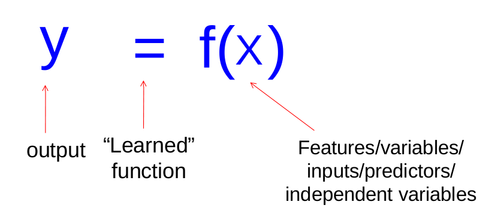{width=55%}

\raggedright

- Un modelo es una **función**: le das características de un caso y te devuelve una predicción
- No es una teoría, no es una explicación, no es una ley: es una **regla de asociación** ajustada a unos datos concretos
- La pregunta que contesta siempre tiene esta forma: *dado lo que sé de este caso, ¿qué esperaría de la variable que no observo?*

## Aprender de los datos, no escribir reglas

\centering

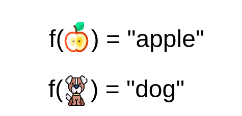{width=46%}

\raggedright

- La programación clásica: tú escribes la regla, la computadora la aplica
- El aprendizaje de máquina: tú le das ejemplos con la respuesta, y **la computadora escribe la regla**
- Por eso funciona donde la regla es imposible de escribir a mano (¿esto es una manzana? ¿este trámite es fraudulento?)
- Y por eso falla de formas raras: la regla que aprendió puede no ser la que tú creías

## Los tres ingredientes

1. **Features** ($X$): lo que sabes de cada caso — edad, ingreso, historial de inspecciones, municipio
2. **Etiqueta** ($y$): lo que quieres predecir — sobrevivió / no sobrevivió, monto, riesgo alto / bajo
3. **Algoritmo**: la receta que busca la $f$ tal que $f(X) \approx y$

- Gran parte del éxito de un modelo depende de haber **construido las features correctas**, no de haber elegido el algoritmo de moda
- Sin etiqueta no hay aprendizaje supervisado. "Quiero predecir corrupción" no es una etiqueta; "esta obra fue sancionada por la ASF en los 2 años siguientes" sí lo es

## Supervisado y no supervisado

\centering

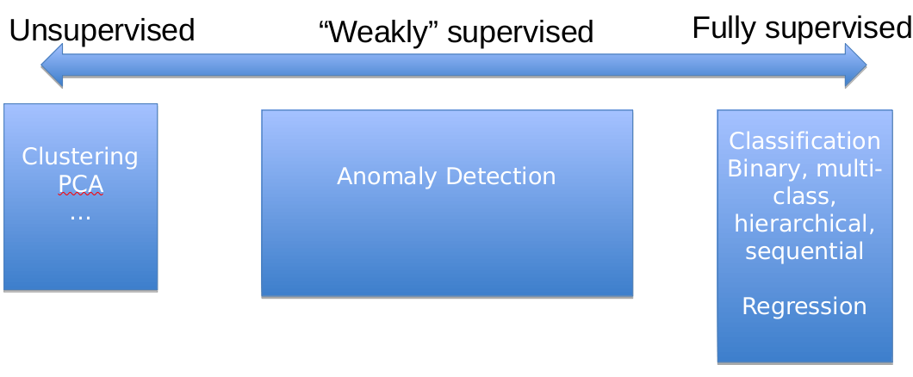{width=60%}

\raggedright

- **Supervisado**: tenemos historia calificada, sabemos la respuesta correcta de casos pasados y podemos supervisar la predicción
- **No supervisado**: no hay respuesta correcta; buscamos estructura, patrones, grupos
- La diferencia práctica: en supervisado se puede **medir el error**; en no supervisado, no del todo

## Regresión o clasificación

Si la $y$ es **numérica** el problema es de regresión; si es **categórica**, de clasificación.

| Pregunta | Tipo |
|---|---|
| ¿Este trámite tiene documentación falsa? | Clasificación |
| ¿Cuántos alumnos se inscribirán el próximo ciclo? | Regresión |
| ¿Este embarazo es de alto riesgo? | Clasificación |
| ¿Cuánto tardará este expediente en resolverse? | Regresión |
| ¿Esta imagen satelital muestra tala ilegal? | Clasificación |

- La misma pregunta puede plantearse de las dos formas — y **la decisión la tomas tú**, no el algoritmo

## Clasificación binaria y la etiqueta positiva

- El caso más común en política pública: dos categorías, y una nos interesa más
- La **etiqueta positiva** (el "1") es el evento que queremos encontrar: el fraude, la deserción, la violación a la norma
- Casi siempre es la **rara**: 2%, 0.5%, 0.1% de los casos. Eso va a dominar todo lo que hagamos después
- Muchos modelos no devuelven un 1 o un 0, sino un **número entre 0 y 1**: un puntaje. Para actuar hay que decidir un corte

# Generalizar

## El objetivo no es explicar el pasado

\centering

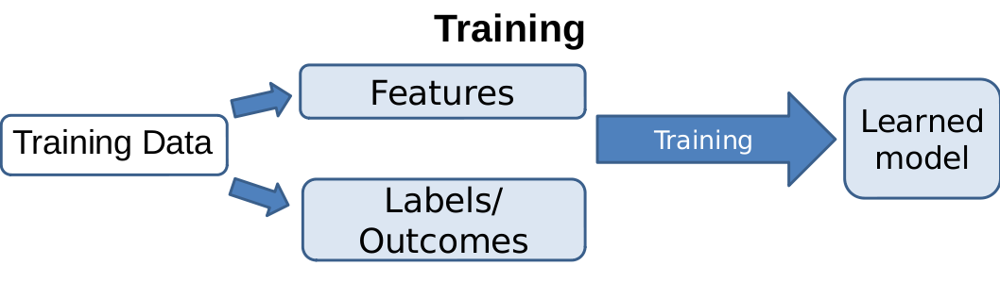{width=46%} 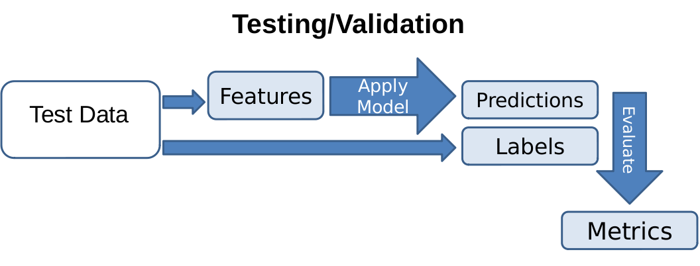{width=46%}

\raggedright

- Un modelo que reproduce perfectamente los datos que ya tienes no sirve de nada: esos casos ya los conoces
- Lo que importa es el desempeño en **datos que el modelo nunca vio** — porque así se va a usar
- Podríamos hacer una prueba de campo y esperar seis meses... o podríamos simularla hoy

## Train y test

- Partimos los datos: típicamente **80% entrenamiento, 20% prueba**
- El modelo se entrena **solo** con el 80%. El 20% restante lo guardamos y no lo tocamos
- Al final medimos el desempeño en ese 20% — que para el modelo son datos del futuro
- El test es una **simulación honesta** de la puesta en producción

## El test se toca una vez

```python
X_train, X_test, y_train, y_test = train_test_split(
    X, y, test_size=0.2, random_state=1234, stratify=y)
```

- Ejemplo ilustrativo: precisión en train 90%, en test 87%, en producción 88%. La estimación funcionó
- Regla dura: **todo lo que aprende algo de los datos va después del split** (escalar, imputar, codificar, seleccionar variables)
- Si eliges hiperparámetros probando en test, el test deja de ser test: es entrenamiento disfrazado
- `stratify=y` conserva la proporción de la clase positiva en ambos lados

## Cuando los datos tienen tiempo

- Inspecciones, trámites, delitos, deserción escolar: casi todo en política pública tiene fecha
- Partir al azar significa entrenar con enero de 2024 y evaluar con marzo de 2023: **el modelo ve el futuro**
- Con datos temporales el split es por **fecha de corte**: entreno con el pasado, evalúo con el futuro
- Esto imita cómo se va a usar el modelo en la realidad — y siempre da métricas más bajas (y más honestas)

## Sobreajuste

\centering

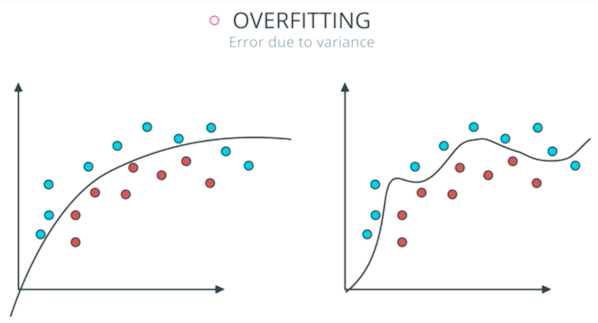{width=48%}

\raggedright

- El modelo memoriza el ruido de los datos de entrenamiento: cada punto, cada excepción
- Excelente en train, malo en test. Aprendió los casos, no el patrón
- Ocurre cuando el modelo es demasiado flexible para la cantidad de datos que tienes

## Subajuste

\centering

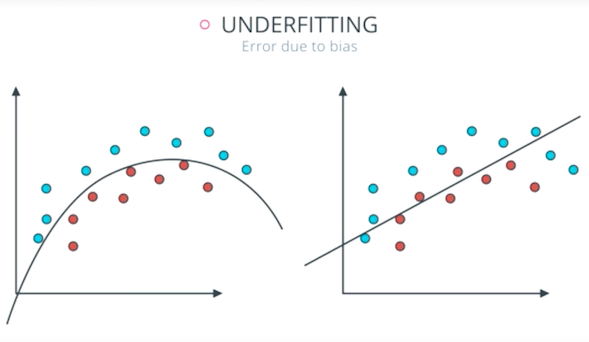{width=45%}

\raggedright

- El modelo es demasiado simple para el patrón que hay: ni siquiera aprende lo que sí está
- Malo en train **y** malo en test — que es, al menos, un síntoma fácil de ver
- Con muy pocos datos, un modelo simple es la decisión correcta, no un error

## El balance

\centering

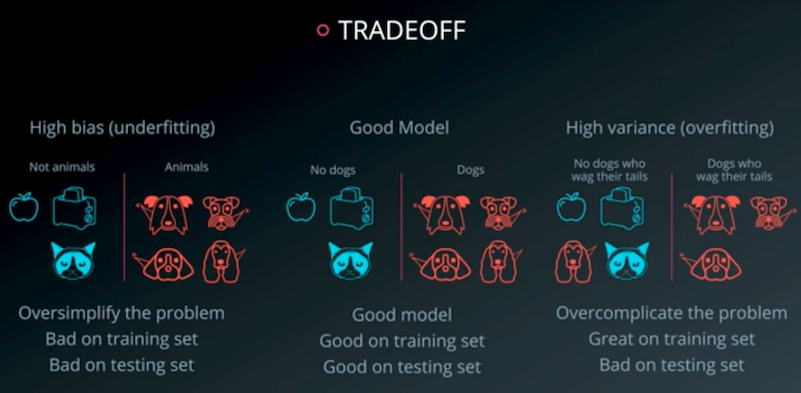{width=65%}

\raggedright

- Demasiado simple: **sesgo** alto. Demasiado flexible: **varianza** alta
- No hay un modelo "correcto" en abstracto: hay un punto de complejidad adecuado para *estos* datos

## Cómo se ve en una gráfica

\centering

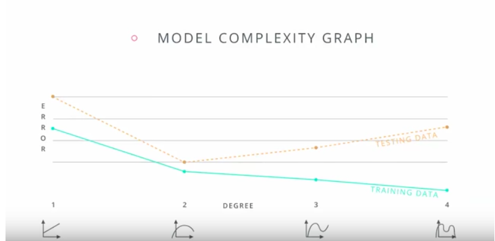{width=57%}

\raggedright

- El error en train baja siempre que subes complejidad. El error en test baja... y luego **sube**
- Ese punto donde el error de test empieza a subir es el límite
- Por eso hace falta el test: sin él, la curva verde te haría creer que el modelo mejora sin parar

## Cómo se controla el sobreajuste

- **Limitar la complejidad**: profundidad máxima de un árbol, número de vecinos en KNN, regularización
- **Más datos**: casi siempre lo mejor, casi nunca lo posible
- **Menos features**: cientos de variables con cientos de observaciones es una receta de memorización
- **Validación cruzada**: partir el train en varios pedazos para elegir hiperparámetros sin tocar el test
- El síntoma que siempre debe encender la alarma: un desempeño **demasiado bueno**

# Fuga de datos

## Fuga de datos (data leakage)

\centering

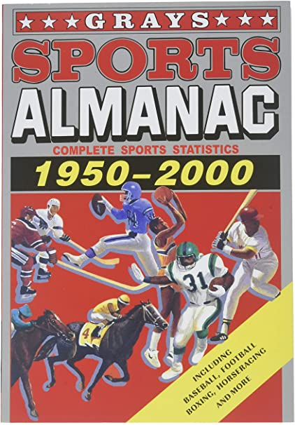{width=26%}

\raggedright

\vspace{0.4em}

**Fuga**: información que el modelo no tendría disponible al momento de predecir se cuela al entrenamiento.

## Los tres casos clásicos

\vspace{0.6em}

1. **Escalar (o imputar, o codificar) antes del split** — el test le pasa su media al train
2. **Variables que conocen el futuro** — el almanaque deportivo de 1950 a 2000
3. **Duplicados entre train y test** — el modelo ya vio la respuesta del examen

\vspace{0.6em}

Las tres se ven igual desde afuera: un modelo con resultados demasiado buenos.

## Caso 1: transformar antes de partir

```python
# MAL: la media y la desviación se calculan con TODOS los datos
X_esc = StandardScaler().fit_transform(X)
X_train, X_test, y_train, y_test = train_test_split(X_esc, y)

# BIEN: primero partir, después aprender la transformación con train
X_train, X_test, y_train, y_test = train_test_split(X, y)
scaler = StandardScaler().fit(X_train)
X_train_s = scaler.transform(X_train)
X_test_s  = scaler.transform(X_test)
```

- Aplica igual a `SimpleImputer`, `OneHotEncoder`, selección de variables y hasta a quitar outliers
- Es la fuga más frecuente y la más fácil de ver: busca cualquier `fit` que ocurra **antes** del split

## Caso 2: variables que conocen el futuro

- Predecir si un paciente será hospitalizado usando `dias_de_hospitalizacion`
- Predecir deserción escolar usando `motivo_de_baja`
- Predecir si una empresa será sancionada usando `monto_de_la_multa`
- Predecir demanda del programa usando el padrón **actualizado después** del cierre

\vspace{0.4em}

\begin{center}\textbf{¿Este dato ya existía, y con este valor, el día en que hay que tomar la decisión?}\end{center}

\vspace{0.4em}

- Si la respuesta es no, la variable se va. Aunque sea la más predictiva. **Sobre todo** si es la más predictiva

## Caso 3: duplicados entre train y test

- El mismo trámite capturado dos veces, el mismo establecimiento con dos IDs, el mismo hogar en dos rondas de encuesta
- Si una copia cae en train y la otra en test, el modelo no predice: **recuerda**
- También pasa con panel: si una entidad tiene 12 renglones mensuales, el split al azar la parte a la mitad
- La solución: quitar duplicados antes, y con datos panel partir **por entidad**, no por renglón

## Cómo detectarla

```python
print(df.duplicated().sum())                   # duplicados exactos
print(df["id_establecimiento"].duplicated().sum())  # por entidad
```

- Revisa correlaciones absurdamente altas entre una feature y la etiqueta
- Revisa fechas: ¿alguna variable tiene fecha posterior a la etiqueta?
- Y sobre todo: **desconfía de los buenos resultados**. Un AUC de 0.99 en un problema social no es un modelo genial, es una fuga

# El proyecto completo

## El flujo de un proyecto de ML

\centering

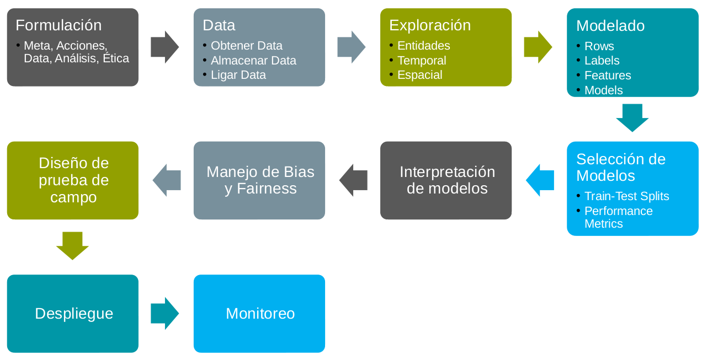{width=70%}

## El flujo de un proyecto de ML (cont.)

- **Formulación**: ¿qué decisión queremos mejorar y qué acción se va a tomar?
- **Datos y exploración**: obtenerlos, ligar fuentes, entender entidades, tiempo y espacio. Aquí se va la mitad del proyecto
- **Modelado y selección**: features, etiquetas, train/test, métricas — aquí se decide qué significa "bueno"
- **Interpretación, sesgo y equidad**: quién gana y quién pierde con este modelo
- **Prueba de campo, despliegue, monitoreo**: los modelos se degradan y hay que reentrenarlos

## En la práctica no es una línea

\centering

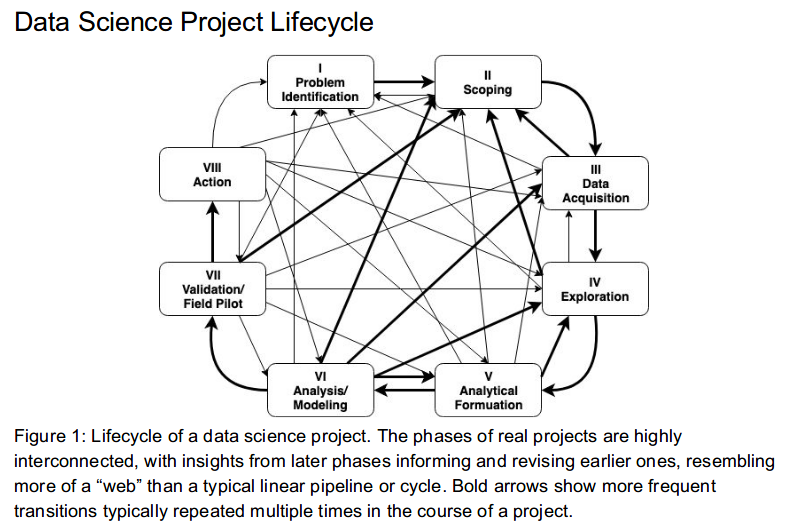{width=52%}

\raggedright

- Cada hallazgo tardío te regresa a redefinir el problema o a buscar más datos
- Si tu proyecto avanzó en línea recta, probablemente no exploraste lo suficiente

## ¿Contra qué nos comparamos?

- **Baserate**: la tasa actual de lo que queremos predecir. Si el 3% de los establecimientos tiene una violación grave, ese 3% es el baserate
  - Es la cantidad que queremos *afectar* con la acción
- **Baseline**: cómo se resuelve el problema **hoy**, medido con la misma métrica
  - Las inspecciones se hacen al azar
  - Las inspecciones se hacen por antigüedad del establecimiento
  - Las inspecciones se hacen con una regla que escribió alguien en 2011
- Un modelo con 85% de precisión no significa nada si la regla actual da 87%

## Qué verificar cuando el agente hace esto

Un agente escribe este pipeline en veinte segundos, con la sintaxis correcta. Lo que se equivoca es **el orden** y **la formulación** — y ninguna de las dos hace que el código truene.

1. **¿Hay un `train_test_split`, y está antes de todo lo demás?** Cualquier `fit` o `fit_transform` anterior al split es fuga
2. **¿Cada feature existía el día de la decisión?** Pide la lista de variables y revísala una por una; la más predictiva es la primera sospechosa
3. **¿Los datos tienen tiempo?** Si sí, el split debe ser por fecha de corte, no aleatorio — pregúntale explícitamente

## Qué verificar cuando el agente hace esto (cont.)

4. **¿Hay duplicados o renglones repetidos por entidad?** Pide `df.duplicated().sum()` y el conteo de IDs repetidos antes de creerle al modelo
5. **¿Reportó desempeño en train y en test?** Solo train no dice nada; una brecha enorme entre los dos es sobreajuste
6. **¿Contra qué baseline lo comparó?** Sin baserate ni baseline, cualquier número suena bien
7. **¿El resultado es demasiado bueno?** Con 0.99 la hipótesis número uno es fuga, no genialidad
