```{r setup, include=FALSE}
knitr::opts_chunk$set(echo = FALSE)
knitr::opts_chunk$set(message = FALSE, warning = FALSE)
```

# Clasificar a mano

## Hoy somos el algoritmo

- Vamos a clasificar casos **sin computadora**: con una regla, un lápiz y unas cuentas
- Dos algoritmos completos, paso a paso: **K vecinos más cercanos** y **árboles de decisión**
- Y dos más en intuición: **regresión logística** y **Naive Bayes**
- No es nostalgia. Es la única forma de saber después si `sklearn` te dio lo que pediste
- Regla del día: si no puedes hacerlo con diez renglones a mano, no puedes auditarlo con diez mil

# K vecinos más cercanos

## La idea: pregúntale a tus vecinos

\centering

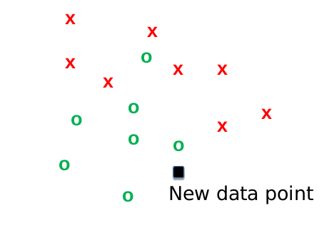{width=38%}

\raggedright

- Llega una observación nueva (el cuadro negro). ¿Es una `x` o una `o`?
- KNN contesta: **busca los $k$ casos más parecidos que ya conoces y hazles caso** (voto mayoritario)
- No hay entrenamiento: el "modelo" **son los datos**. Guardas la tabla y ya
- El costo se paga al predecir: para cada caso nuevo hay que medir la distancia a *todos* los anteriores

## ¿Qué es estar cerca?

\centering

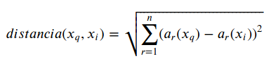{width=42%}

\raggedright

Cada feature es una dimensión. Con dos establecimientos $A = (12\text{ empleados},\ 3\text{ años})$ y $B = (30, 1)$:

$$d(A,B) = \sqrt{(12-30)^2 + (3-1)^2} = \sqrt{324 + 4} = 18.1$$

- Fíjate quién manda: los empleados aportan 324 y los años aportan 4
- Hay otras distancias (Manhattan, coseno, Hamming para categóricas) — la euclidiana es la de default
- La distancia es una **decisión de modelado**: define qué significa "parecerse" en tu problema

## La k cambia la respuesta

\centering

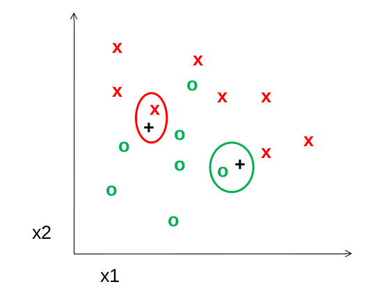{width=30%} 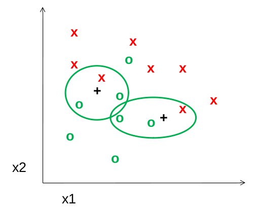{width=30%} 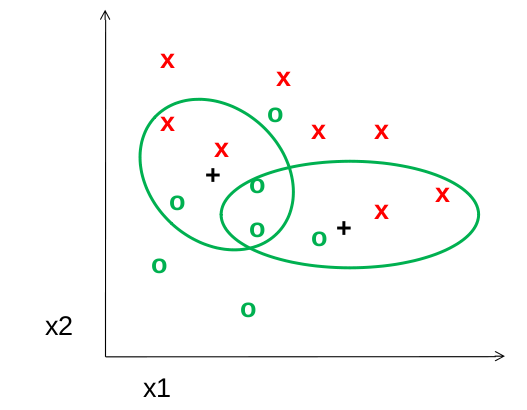{width=30%}

$k = 1$ \hspace{4.2em} $k = 3$ \hspace{4.2em} $k = 5$

\raggedright

\vspace{0.4em}

- Con $k=1$ el punto de la izquierda es `x`; con $k=3$ y $k=5$ es `o`. **Los datos no cambiaron; la respuesta sí**
- El mismo caso, tres clasificaciones distintas, y ninguna es "la verdadera"

## ¿Qué k elegir?

- $k$ **chica**: la frontera sigue cada punto, incluido el ruido. Sobreajuste
- $k$ **grande**: todo se promedia, la frontera se aplana y los grupos pequeños desaparecen. Subajuste
- $k$ **par** en un problema binario puede empatar: usa impares
- Se elige probando varios valores y midiendo el error — pero **con validación, nunca con el test**
- "Usé $k=5$" no es una justificación; $k=5$ es simplemente el default de `sklearn`

## Todo tiene que ser numérico y comparable

\centering

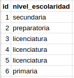{width=16%}

\raggedright

\vspace{0.4em}

- **Categóricas**: no hay distancia entre "primaria" y "licenciatura". Se convierten con *one-hot encoding*: una columna 0/1 por categoría
- Codificarlas como 1, 2, 3 le inventa al modelo una jerarquía y unas distancias que no existen

## Todo tiene que ser numérico y comparable (cont.)

- **Numéricas**: hay que **escalar**. Ingreso mensual (5,000 a 80,000) contra años de escolaridad (0 a 20):

$$(\Delta\text{ingreso})^2 = 20{,}000^2 = 400{,}000{,}000 \qquad (\Delta\text{escolaridad})^2 = 15^2 = 225$$

- La escolaridad no es que pese poco: **no existe**. El modelo es un modelo de ingreso disfrazado
- Olvidar el escalamiento no produce ningún error: produce un resultado distinto y en silencio

## KNN: fortalezas y trampas

**A favor**

- Premisa simple y fácil de explicarle a quien toma la decisión
- Captura fronteras irregulares sin que le digas la forma
- Resiste bien algunos datos raros

**En contra**

- Caro al predecir: distancia a todas las observaciones, cada vez
- Sin escalar da predicciones distintas, sin avisar
- Sufre con muchas features: en muchas dimensiones todo queda lejos de todo
- Elegir $k$ depende del problema y de quien modela

## El vecino más cercano de Carlos III

\begin{center}
\includegraphics[height=2.6cm]{../images/king_charles.jpg}\hspace{1.5em}
\includegraphics[height=2.6cm]{../images/ozzy_osbourne.jpg}

\vspace{0.2em}
\small Nacidos en 1948 · criados en Inglaterra · casados dos veces · hijos famosos · ricos · viven en un castillo
\end{center}

- Con esas seis features, para KNN son **el mismo punto**: distancia casi cero, cada uno es el vecino más cercano del otro
- "Cercano" solo significa cercano **en las columnas que tú elegiste**; la distancia no ve nada más
- Antes de confiar en los vecinos, pregunta: ¿parecidos según qué? ¿Esas features capturan lo que importa para *esta* predicción?

# Árboles de decisión

## Titanic: la ficción contra los datos

\centering

"Mujeres y niños primero": ¿Hombre? → si sí, ¿mayor de 10 años?

\raggedright

| Grupo | Sobrevivieron | ¿Predicción? |
|---|---|---|
| Mujeres | **74%** | Sobrevive |
| Hombres mayores de 10 | **18%** | No sobrevive |
| Hombres de 10 o menos | **22%** | ...¿? |

- El sexo separa muy bien. La edad, entre hombres, **casi no separa nada**: 18% contra 22%
- Ojo con el detalle: 177 pasajeros no tienen edad registrada y cayeron en el grupo de "10 o menos". Esa decisión de limpieza mueve el número
- ¿Cómo mejoramos? Cambiar el corte de edad, o buscar otra variable. Un árbol hace exactamente eso, pero probándolas **todas**

## Un buen corte deja nodos puros

\centering

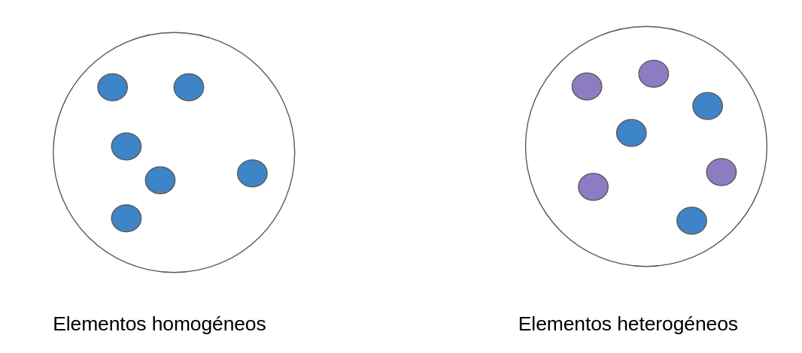{width=58%}

\raggedright

- Un nodo **puro** tiene solo un tipo de caso; uno impuro los tiene revueltos
- El algoritmo busca, entre todas las variables y todos los cortes, el que deja los grupos **más puros**

## La entropía

La medida clásica de impureza es la **entropía** (Shannon, 1948):

$$Entropia = -\sum_i p_i \log_2 p_i$$

- Entropía 0 = todos iguales (una hoja). Entropía 1 = mitad y mitad (una moneda al aire)
- La **ganancia de información** es cuánta entropía elimina un corte. Gana el corte que más gana

## El algoritmo, en seis pasos

1. Calcular la entropía de la variable a clasificar
2. Calcular la entropía de la etiqueta **respecto a** una variable predictora
3. Calcular la ganancia de información de esa variable
4. Repetir 2 y 3 para **cada** variable predictora
5. Elegir como nodo de decisión la de **mayor ganancia**
6. Repetir con cada subconjunto resultante hasta que la entropía sea 0 o ya no haya con qué dividir

- Es todo. No hay más magia: contar, medir el desorden y quedarse con el corte que más lo reduce

## Ejemplo a mano: ¿jugamos golf?

\centering

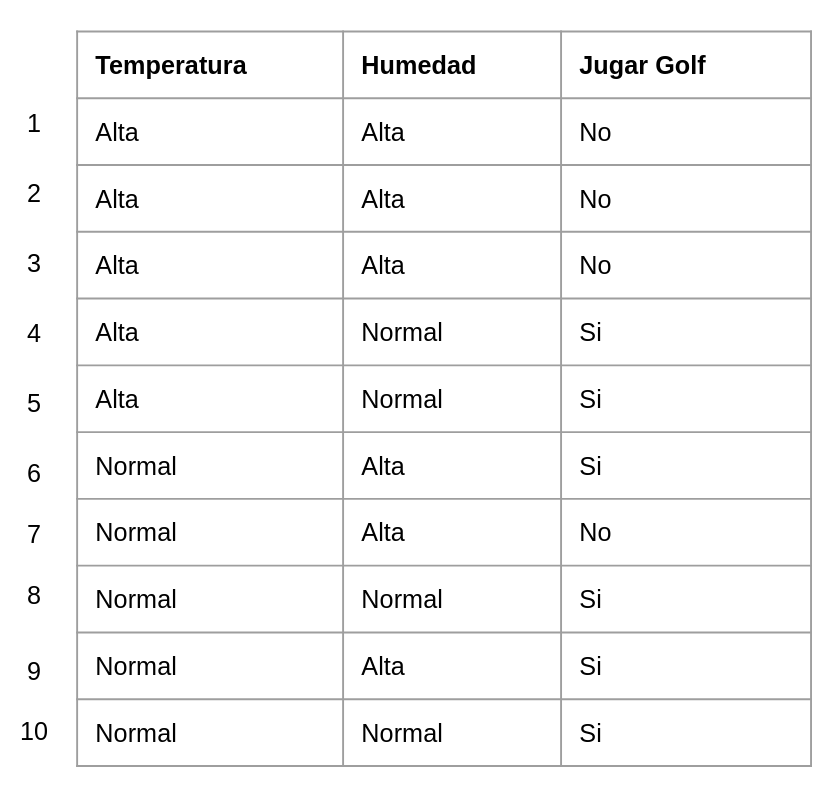{width=36%}

\raggedright

- 10 observaciones, dos predictoras (temperatura, humedad) y una etiqueta (jugar golf)
- Vamos a construir el árbol completo, a mano

## Paso 1: la entropía de la etiqueta

\centering

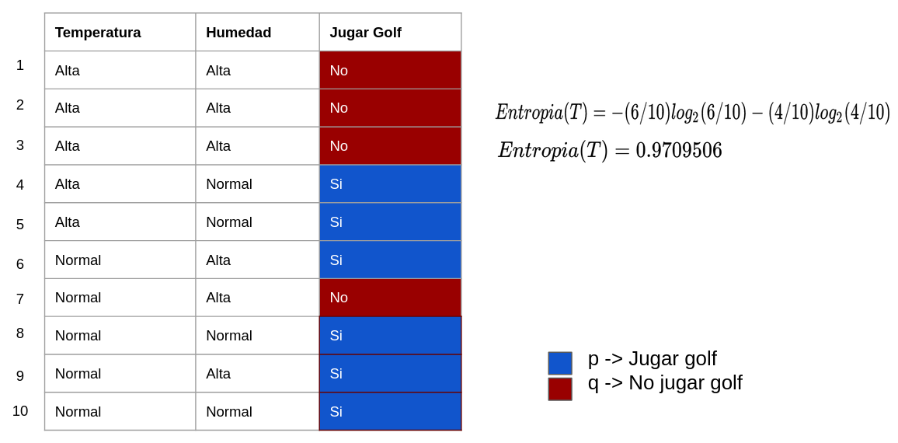{width=62%}

\raggedright

- 6 de 10 sí jugamos, 4 de 10 no. Entropía = **0.971**: bastante revuelto (el máximo es 1)
- Este es el desorden de partida; todo corte se juzga contra este número

## Paso 2: entropía dada la temperatura

\centering

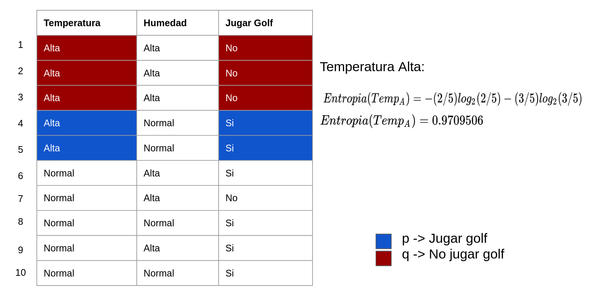{width=46%} 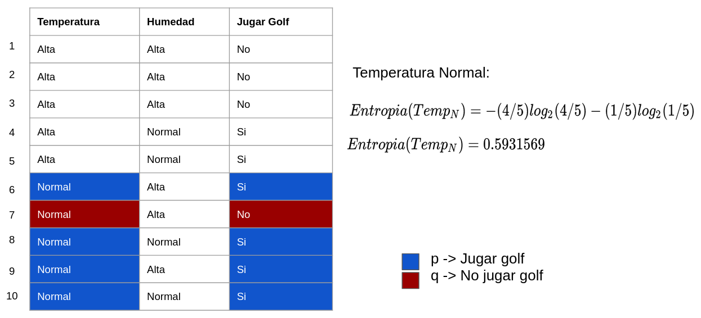{width=46%}

\raggedright

- Temperatura **alta**: 5 casos, 2 sí y 3 no → entropía 0.971. Igual de revuelto que antes
- Temperatura **normal**: 5 casos, 4 sí y 1 no → entropía 0.593. Algo mejor

## Paso 3: la ganancia de la temperatura

\centering

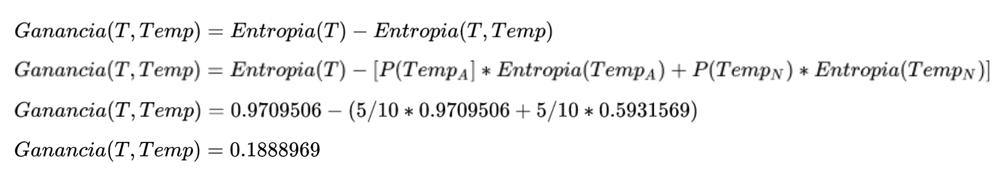{width=82%}

\raggedright

- Ganancia = entropía original menos el **promedio ponderado** de las entropías de los hijos
- Partir por temperatura elimina **0.189** de desorden. Guárdalo y compáralo con la otra variable

## Paso 4: la humedad

\centering

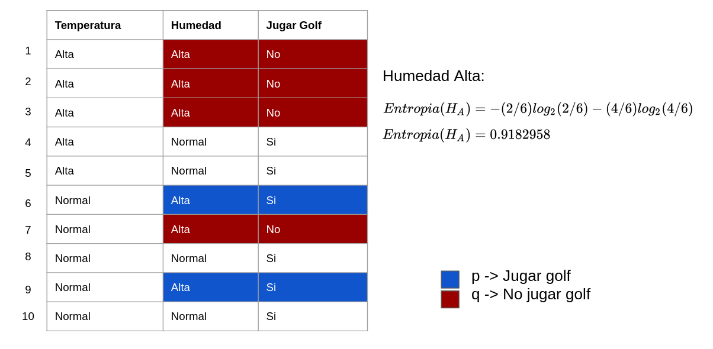{width=44%} 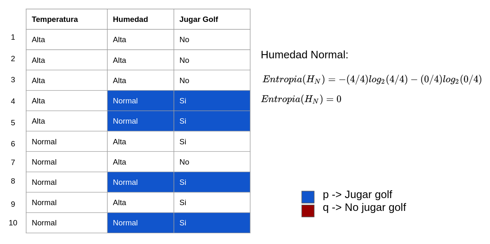{width=44%}

\raggedright

- Humedad **alta**: 6 casos, 2 sí y 4 no → entropía 0.918
- Humedad **normal**: 4 casos, los 4 sí → entropía **0**. Nodo perfectamente puro: eso es una hoja

## Paso 5: gana la humedad

\centering

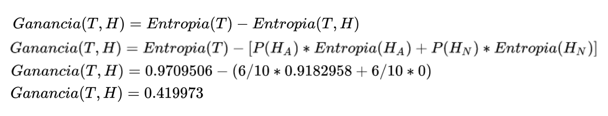{width=88%}

\vspace{0.5em}

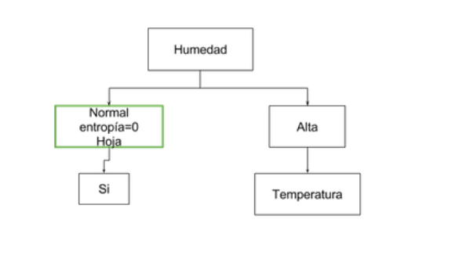{width=40%}

## Paso 5: gana la humedad (cont.)

- Humedad gana **0.420** contra 0.189 de temperatura → humedad es el **nodo raíz**
- La rama "normal" ya terminó: entropía 0, predicción "sí jugar"

## Paso 6: seguimos con humedad alta

\centering

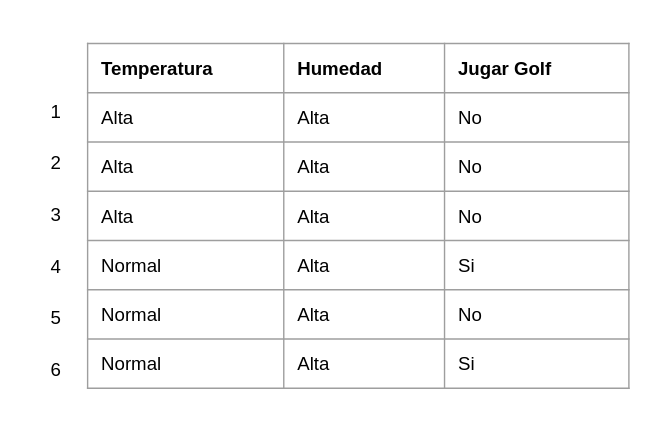{width=36%} 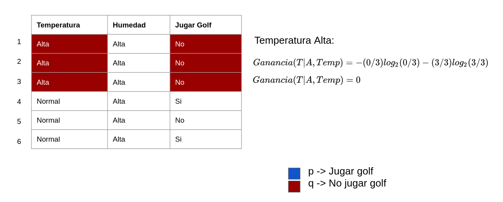{width=54%}

\raggedright

- Quedan 6 observaciones. Volvemos al paso 2 **solo con ellas** y con las variables que faltan
- Temperatura alta: 3 casos, los 3 "no" → entropía 0, otra hoja
- Temperatura normal: 3 casos, 2 "sí" y 1 "no". Ya no hay más variables: gana la mayoría

## El árbol final

\centering

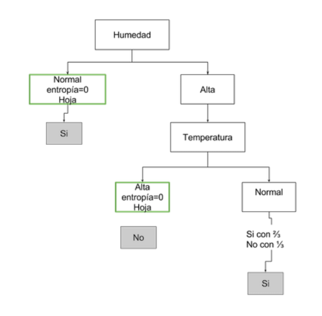{width=44%}

## El árbol final (cont.)

- Se lee de arriba hacia abajo, y cabe en una tarjeta
- Nota la última hoja: "sí" con 2 de 3. **Una predicción no es una certeza**, es la mayoría de un grupo pequeño
- Tres observaciones no son evidencia de nada. Un árbol sin límites llega a hojas de un solo caso

## Clasifica este caso

\centering

Llega un día nuevo: **humedad alta, temperatura normal**. ¿Jugamos?

\raggedright

\vspace{0.8em}

- Raíz: ¿humedad? Alta → nos vamos a la derecha
- Siguiente: ¿temperatura? Normal → hoja de la derecha
- Predicción: **sí jugar**, con una confianza de 2/3

\vspace{0.8em}

- Esto es lo que hace `predict()` con cada renglón: bajar por el árbol y devolver la etiqueta de la hoja
- Y esto es lo que puedes explicarle a un inspector, a un juez o a un comité — la razón por la que los árboles siguen vivos

## Profundidad: sobreajuste y subajuste

- Si dejas al árbol crecer sin límite, sigue partiendo hasta que **cada hoja tenga un solo caso**: memoriza y no generaliza
- Si lo limitas demasiado, no alcanza a capturar el patrón: subajuste
- Los dos hiperparámetros que importan: `max_depth` (qué tan hondo) y `min_samples_leaf` (mínimo de casos por hoja)
- No hay valor correcto: dependen del problema y de cuántos datos tengas
- Otro problema: los árboles son **inestables**. Cambia unas cuantas observaciones y el árbol se ve completamente distinto

# Del árbol al bosque, y dos modelos más

## Random Forest: el promedio de muchos árboles

- Si un árbol es inestable, hagamos **muchos** y promediemos. Un bosque aleatorio es un ensamble de árboles
- La diversidad se fabrica a propósito, de dos formas:
  1. Cada árbol se entrena con una **muestra aleatoria con reemplazo** de los datos (*bagging*)
  2. En cada corte, cada árbol solo puede ver un **subconjunto aleatorio de features**
- La predicción final es el **voto** de todos los árboles (o el promedio de sus probabilidades)
- Ganamos mucho poder predictivo y baja la varianza. Perdemos la regla legible: 500 árboles no se explican en una tarjeta
- La regla del curso: si el bosque no le gana claramente al árbol, quédate con el árbol

## Regresión logística, en intuición

\centering

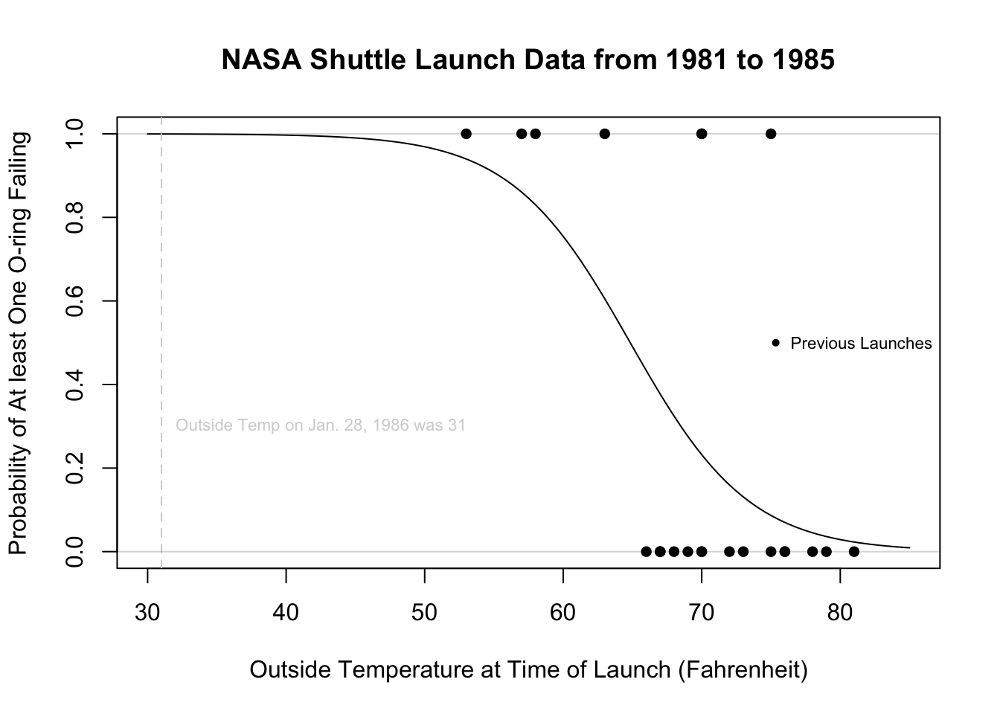{width=29%}

\raggedright

- Queremos una **probabilidad**, y una recta se sale de $[0,1]$. La logística la "aplasta" con una curva en forma de S
- Cada variable tiene un **coeficiente interpretable**: cuánto mueve la probabilidad, en qué dirección
- Sale un número entre 0 y 1 — y para actuar hace falta elegir un corte (el tema de la próxima clase)
- Es la línea base obligatoria de casi cualquier problema de clasificación

## Naive Bayes, en intuición

- Le da la vuelta a la pregunta con el teorema de Bayes: $P(y \mid X) = \dfrac{P(X \mid y)\,P(y)}{P(X)}$
- En vez de "¿qué tan probable es que sea spam dadas estas palabras?", pregunta "¿qué tan probable es ver estas palabras en un spam?" — y eso sí se puede contar
- Es **naive** (ingenuo) porque supone que las features son **independientes** entre sí. Casi nunca es cierto: "gratis" y "oferta" aparecen juntas
- Aun así funciona sorprendentemente bien, es rapidísimo y sirve con pocos datos
- Sus probabilidades están mal calibradas: úsalas para **ordenar** casos, no como probabilidades reales

## Qué verificar cuando el agente hace esto

1. **¿Escaló antes de usar KNN?** Es la trampa silenciosa: sin escalar el código corre igual y clasifica por la variable con los números más grandes
2. **¿De dónde salió la $k$ o la `max_depth`?** Si no hay una curva de validación detrás, es el default. Pídele que lo diga
3. **¿Codificó las categóricas con one-hot o les puso 1, 2, 3?** La segunda inventa un orden y unas distancias que no existen
4. **¿Puso límites al árbol?** Sin `max_depth` ni `min_samples_leaf` el árbol memoriza; pide la profundidad y el tamaño de las hojas

## Qué verificar cuando el agente hace esto (cont.)

5. **¿Cuántas observaciones hay en cada hoja?** Una regla apoyada en tres casos no es una regla, y el árbol la dibuja igual de bonita
6. **¿Puedes seguir a mano una predicción?** Toma un caso, bájalo por el árbol y compara con `predict`: si no coinciden, algo está mal en el pipeline
7. **¿Interpretó la importancia de variables como causalidad?** Los agentes escriben "X causa Y" con toda naturalidad; la importancia solo dice cuánto ayudó a partir los nodos
