```{r setup, include=FALSE}
knitr::opts_chunk$set(echo = FALSE)
knitr::opts_chunk$set(message = FALSE, warning = FALSE)
```

# ¿Comparado con qué?

## \textquotedblleft El modelo tiene 92%\textquotedblright{} \textemdash{} ¿y?

- Un número solo no dice nada. Un 92% puede ser un modelo excelente o un modelo bastante malo
- Tres preguntas antes de mirar cualquier métrica:
  1. ¿92% de qué? ¿Qué está contando exactamente esa métrica?
  2. ¿Comparado con qué? ¿Cómo se resuelve el problema hoy?
  3. ¿Qué error está escondiendo? Toda métrica resume, y resumir es tirar información
- Hoy: qué mide cada métrica, cuál mentira cuenta cada una, y por qué **elegir la métrica es una decisión de política pública**

## Baserate y baseline

**Baserate**: la tasa actual de lo que queremos predecir

- Si el 2% de los establecimientos tiene una violación grave, ese 2% es el baserate
- Es lo que queremos afectar con la acción, y cambia según cuándo lo midas

**Baseline**: el desempeño de cómo se hace el trabajo hoy, medido con la misma métrica

- Las inspecciones se hacen al azar
- Las inspecciones se hacen por antigüedad del establecimiento
- Las inspecciones siguen una regla que alguien escribió en 2011

\vspace{0.4em}

\begin{center}Sin baseline, cualquier número suena bien.\end{center}

# La matriz de confusión

## Dos formas de equivocarse

\centering

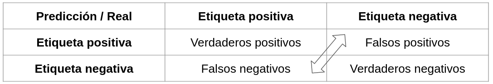{width=88%}

\raggedright

\vspace{0.3em}

- **Falso positivo** (error tipo I): dije que sí y era no. Molesté a quien no debía
- **Falso negativo** (error tipo II): dije que no y era sí. Se me escapó
- Los cuatro números son la materia prima: todas las métricas de clasificación salen de esta tabla
- Antes de calcular nada, mira los cuatro. Ninguna métrica sustituye ver la matriz completa

## ¿Cuál error es peor?

**Un falso positivo es más grave cuando...**

- Una persona inocente es condenada: apelar es lento, caro y muchas veces no ocurre
- Se le retira un apoyo a un hogar que sí calificaba
- La intervención es punitiva: multar, sancionar, detener, negar

**Un falso negativo es más grave cuando...**

- Un diagnóstico de cáncer se pierde: un falso positivo se desmiente con la siguiente prueba; un falso negativo avanza en silencio
- Un establecimiento peligroso nunca se inspecciona
- La intervención es asistiva y el costo de intervenir de más es bajo

\begin{center}\textbf{Esta pregunta se contesta antes de modelar, no después.}\end{center}

## Ejercicio en clase

\footnotesize

| ID entidad | ¿Alto riesgo? (real) | Predicción |
|---|---|---|
| 1 | Sí | No |
| 2 | No | No |
| 3 | Sí | No |
| 5 | Sí | Sí |
| 15 | No | Sí |
| 24 | No | No |
| 35 | Sí | No |
| 47 | Sí | Sí |
| 98 | Sí | No |
| 190 | Sí | Sí |

\normalsize

\begin{center}Llena la matriz de confusión. ¿Cuántos VP, FP, FN y VN hay?\end{center}

## La matriz del ejercicio

|  | Real: Sí | Real: No |
|---|---|---|
| **Predijo: Sí** | VP = **3** | FP = **1** |
| **Predijo: No** | FN = **4** | VN = **2** |

- 7 entidades de alto riesgo, y el modelo encontró 3
- Solo se equivocó una vez señalando de más
- Los cuatro números ya cuentan la historia: este modelo es cauteloso y se le escapa más de la mitad
- Si el objetivo es no dejar pasar riesgos, es un mal modelo. Si el objetivo es no molestar de más, no parece tan malo

## Accuracy

\centering

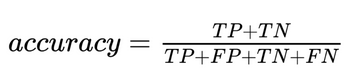{width=50%}

\raggedright

\vspace{0.3em}

- Porcentaje de observaciones clasificadas correctamente. Es la métrica que todo el mundo reporta primero
- En el ejercicio: $(3+2)/10 = 0.5$. Una moneda al aire
- Trata todos los errores como si costaran lo mismo — y casi nunca cuestan lo mismo
- Y tiene un problema peor cuando la clase positiva es rara

## Accuracy engaña: el ejemplo

100,000 establecimientos. 2,000 tienen una violación grave (**baserate = 2%**).

Modelo propuesto: *"ninguno tiene violación"*. Una línea de código, cero inteligencia.

\footnotesize

| Métrica | Valor |
|---|---|
| Accuracy | **98%** |
| Falsos positivos | 0 |
| Falsos negativos | 2,000 |
| Cobertura de violaciones | **0%** |

\normalsize

- 98% de accuracy y cero utilidad: no encuentra ni un solo caso de los que importan
- Con clases desbalanceadas, el accuracy mide qué tan rara es la clase positiva, no qué tan bueno es el modelo
- Y desbalanceados están casi todos los problemas de política pública

# Precisión y cobertura

## Precisión y cobertura

\centering

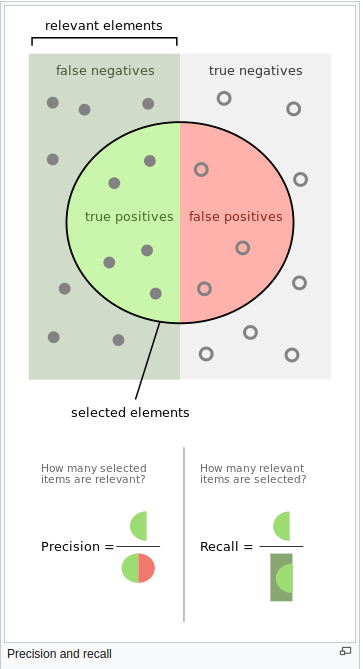{width=24%}

## Precisión y cobertura

- **Precisión** $= \dfrac{VP}{VP+FP}$: de los que señalé, ¿cuántos eran? 
- **Cobertura** (*recall*) $= \dfrac{VP}{VP+FN}$: de los que había, ¿a cuántos encontré? 
- Precisión responde por quien paga la inspección. Cobertura responde por quien se queda sin ella

## Las dos se pelean

- Subir el umbral (señalar solo los casos más seguros): sube la precisión, baja la cobertura
- Bajarlo (señalar a más): sube la cobertura, baja la precisión
- Los dos extremos son inútiles y los dos se ven bien en una métrica:
  - "Todos tienen cáncer": cobertura 100%, precisión igual al baserate
  - Señalar un solo caso, el más obvio: precisión 100%, cobertura ~0%


## F1

\centering

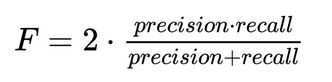{width=50%}

\raggedright

\vspace{0.3em}

- Es la media armónica de precisión y cobertura: un solo número que castiga fuerte si alguna de las dos está mal
- Sirve para comparar modelos rápido y con clases desbalanceadas es mucho mejor que el accuracy
- Le da el mismo peso a los dos errores. Si en tu problema un FN cuesta más que un FP, F1 no ayuda mucho


## Las métricas del ejercicio

Con VP = 3, FP = 1, FN = 4, VN = 2:

\footnotesize

| Métrica | Cuenta | Valor |
|---|---|---|
| Accuracy | $(3+2)/10$ | 0.50 |
| Error tipo I (FP) | $1/10$ | 0.10 |
| Error tipo II (FN) | $4/10$ | 0.40 |
| Precisión | $3/4$ | **0.75** |
| Cobertura | $3/7$ | **0.43** |
| F1 | media armónica | 0.55 |

\normalsize

- Precisión alta, cobertura baja: cuando señala, casi siempre acierta; pero deja pasar a la mayoría
- ¿Es bueno? **Depende de si el costo está en inspeccionar de más o en no inspeccionar**

## La curva precisión\textendash{}cobertura

\centering

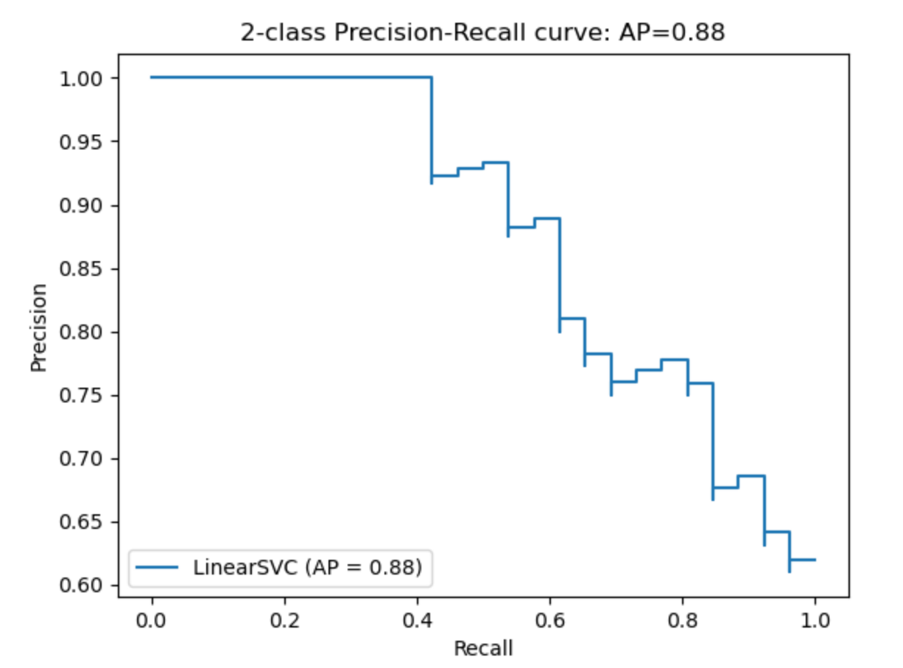{width=38%}

\raggedright

- No hay un punto: hay una curva. Cada punto es un umbral distinto del mismo modelo
- Se lee así: "si quiero 60% de cobertura, mi precisión será de 81%"


## La curva ROC (Receiver Operating Characteristic)

\centering

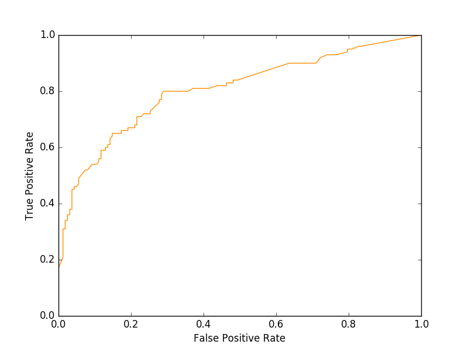{width=41%}

\raggedright

- Grafica la tasa de verdaderos positivos contra la de falsos positivos, para todos los umbrales posibles
- Mejor modelo = curva que se pega a la esquina superior izquierda
- La diagonal es el azar: un modelo que tira volados

## AUC: qué mide y qué esconde

- **AUC** es el área bajo la curva ROC: 0.5 = azar, 1.0 = perfecto
- Mide qué tan bien el modelo separa las dos clases: la probabilidad de que un positivo tomado al azar tenga mayor puntaje que un negativo
- Es independiente del umbral y de la escala
- Ignora el costo asimétrico de los errores**
- Sirve para comparar modelos entre sí.

# Presupuesto: métricas @k

## En política pública siempre hay una k

\centering

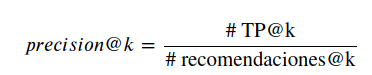{width=40%} \hspace{1em} 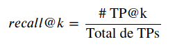{width=36%}

\raggedright

\vspace{0.3em}

- No tienes 100,000 inspecciones: tienes 100 inspectores y seis meses
- La clasificación completa da igual. Lo único que importa son los k casos que sí vas a atender
- El procedimiento: ordena por puntaje, corta en $k$, y calcula precisión y cobertura ahí
- $k$ es tu presupuesto, tu personal, tus camas de hospital, tus becas. La restricción real
- **precision@k** mide qué tan eficientes somos con el recurso; **recall@k**, cómo lo estamos repartiendo entre todos los que lo necesitan

## precision@k y recall@k, con números

100,000 establecimientos, 2,000 con violación (2%), 100 inspectores.

| Estrategia | precision@100 | recall@100 |
|---|---|---|
| Al azar (baseline) | 2% | 0.1% |
| Modelo, top 100 | **62%** | **3.1%** |
| Modelo, top 200 (con el doble de inspectores) | 55% | 5.5% |

- El modelo es 31 veces más eficiente que el azar. Ese es el número que se le presenta a la autoridad
- Pero fíjate en la cobertura: con 100 inspectores el máximo posible es 5% ($100/2{,}000$). El resto no es culpa del modelo, es del presupuesto
- Duplicar inspectores baja la precisión y sube la cobertura: siempre. Esa es la conversación real

## Cómo se calcula

```python
ranking = (pd.DataFrame({"score": y_scores, "real": y_test.values})
             .sort_values("score", ascending=False))

k = 100
top_k = ranking.head(k)

precision_at_k = top_k["real"].mean()                  # eficiencia
recall_at_k    = top_k["real"].sum() / y_test.sum()    # cobertura
```

- Requiere `predict_proba`, no `predict`: necesitas el **puntaje** para poder ordenar

# El umbral y quién decide

## Del puntaje a la acción

\centering

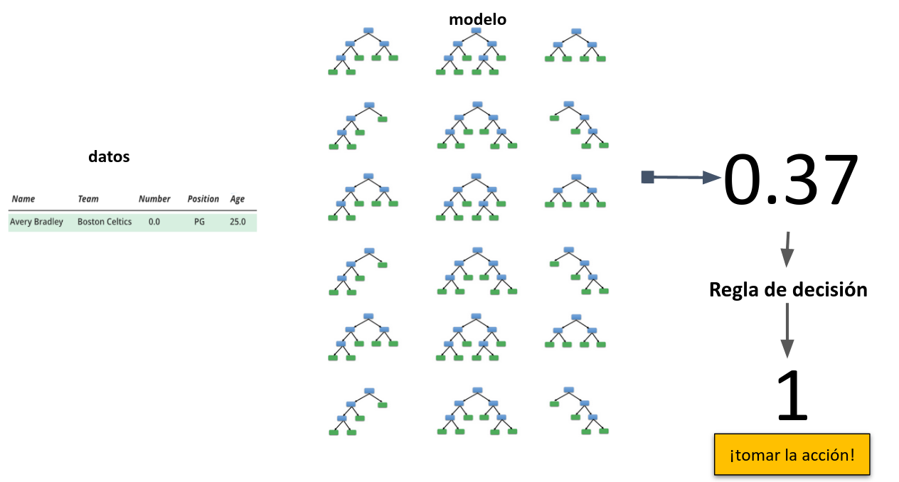{width=58%}

\raggedright

- El modelo devuelve **0.37**. Eso no es una decisión: es un insumo
- Entre el puntaje y la acción hay una regla de decisión: un umbral, o un top $k$
- Esa regla no vive en el modelo. Vive en la política, en el presupuesto y/o en la ley

## Elegir el umbral no es estadística es política

- El 0.5 de `predict()` es un default arbitrario, no un hallazgo. Casi nunca es el umbral que quieres
- Mover el umbral no cambia el modelo: redistribuye los errores entre falsos positivos y falsos negativos
- Y eso es redistribuir daño entre personas concretas: quién es inspeccionado de más, quién se queda sin apoyo
- Esa decisión no la puede tomar el modelo, ni quien lo programó, ni la IA: la toma quien responde por el programa
- El trabajo técnico es poner sobre la mesa la curva y las opciones. El trabajo político es elegir un punto y defenderlo

## La misma métrica, distinta por grupo

\centering

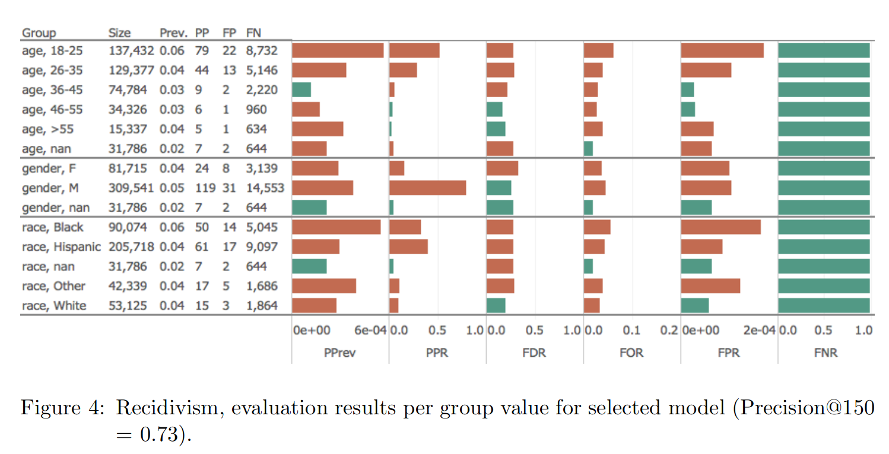{width=78%}

## Cómo leer la gráfica

\small Auditoría por grupo (herramienta *Aequitas*) de un modelo de reincidencia que señala a los $k=150$ de mayor riesgo. Conteos por grupo: `Prev.` = proporción positiva de verdad (su baserate), `PP` = señalados por el modelo, `FP`/`FN` los conocidos. \normalsize

\vspace{0.2em}
\scriptsize

| Barra | Nombre | En palabras |
|---|---|---|
| PPrev | prevalencia predicha | qué proporción **del grupo** fue señalada (PP $\div$ tamaño) |
| PPR | proporción de señalados | de **todos** los señalados, cuántos caen en este grupo |
| FDR | tasa de falso descubrimiento | de los señalados del grupo, cuántos no eran ($= 1 -$ precisión) |
| FOR | tasa de falsa omisión | de los **no** señalados, cuántos sí eran |
| FPR | tasa de falsos positivos | de los que no eran, a cuántos señaló |
| FNR | tasa de falsos negativos | de los que sí eran, a cuántos dejó ir ($= 1 -$ cobertura) |

\normalsize

## La misma métrica, distinta por grupo

- El desempeño global esconde desempeños muy distintos por edad, género o grupo poblacional
- Aquí un modelo con precision@150 = 0.73 tiene tasas de falsos positivos y falsos negativos que varían fuerte entre grupos
- Un modelo puede ser "bueno" en promedio y sistemáticamente peor con quienes ya estaban peor

## ¿Qué métrica de equidad?

\centering

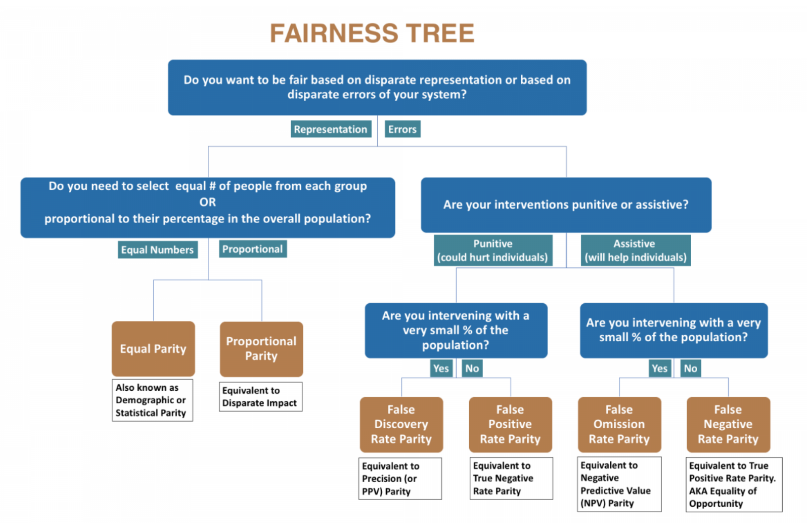{width=68%}

## ¿Qué métrica de equidad? (cont.)

- No existe "el modelo justo": existen definiciones de equidad incompatibles entre sí, y hay que elegir una
- La pregunta clave es si la intervención es punitiva (te puede dañar) o asistiva (te ayuda)
  - Punitiva → cuida los falsos positivos: no castigar de más a un grupo
  - Asistiva → cuida los falsos negativos: no dejar fuera a quien más lo necesita
- Elegir la métrica es elegir a quién proteger. La métrica codifica valores — y alguien tiene que firmarla

## Qué verificar cuando el agente hace esto

1. **¿Reportó la matriz de confusión completa, o solo un número?** Pide los cuatro valores; un accuracy suelto no es un resultado
2. **¿Cuál es el baserate?** Si la clase positiva es el 2%, el accuracy es una trampa por construcción — pide precisión y cobertura
3. **¿Contra qué baseline compara?** Sin la regla actual (o al menos el azar) medida con la misma métrica, no hay evidencia de mejora
4. **¿Hay presupuesto en el problema?** Si hay $k$ inspectores, becas o camas, la métrica es precision@k y recall@k — no AUC

## Qué verificar cuando el agente hace esto (cont.)

5. **¿De dónde salió el umbral?** Si es 0.5, es el default de `predict`, no una decisión. Pide la curva precisión–cobertura y quién eligió el punto
6. **¿Desagregó por grupo?** Pide las métricas por sexo, edad, región o grupo relevante: el promedio esconde el daño
7. **¿La métrica corresponde al costo real del error?** Pregúntale explícitamente qué cuesta más aquí, un FP o un FN, y verifica que la métrica que reportó castigue **ese** error
8. **La IA no puede tomar decisiones por nadie** que es más costoso depende del problema y a veces es una decisión moral. 
